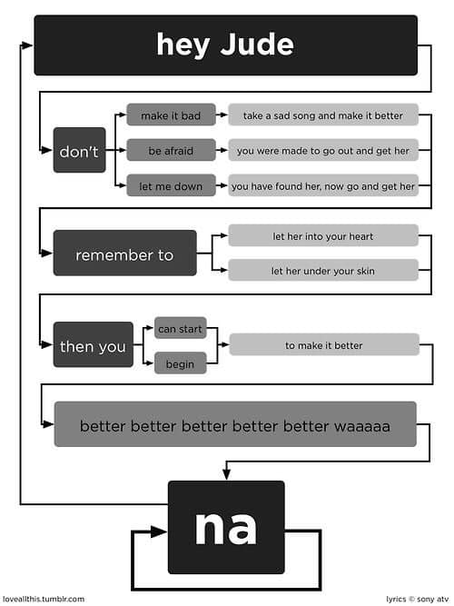
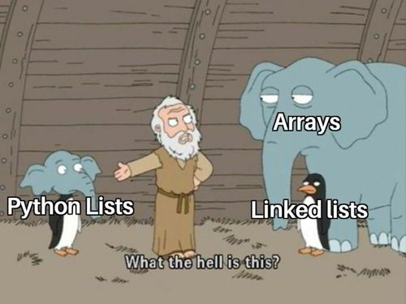
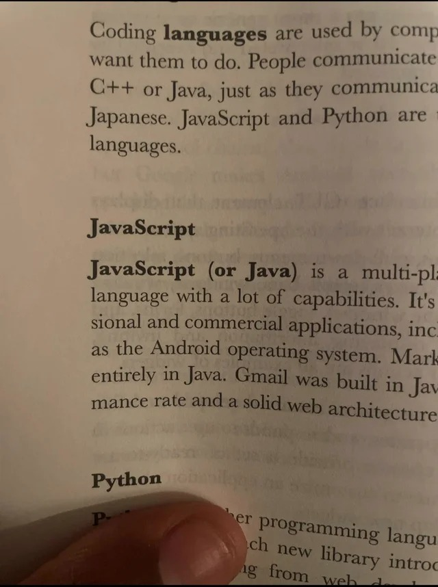

# Memy 

## `learning-go-rust.png`

## `regex.png`

## `binary-tree.png`

## `junior-writing-comments.jpg`

## `iloveyou-vbs.jpg`

## `excel-1-2.jpg`

## `the_floor_is_java.jpg`

## `jezyki.jpg`

## `in-scope-out-of-scope.jpg`

## `1953-no-escape-from-telephone.jpg`

## `mysql-mongo.jpg`

## `automate-10-days.jpg`

## `hey-jude.jpg`

## `python-lists.jpg`

## `girffriend-no-1.jpg`

## `wyzsze-wyksztalcenie.jpg`

## `do-while.jpg`

## `mud-corporate.jpg`

## `outfits.jpg`

## `excel-incel.jpg`

## `it-people.jpg`

## `netscape-ie.jpg`

## `libreoffice-crack.jpg`

## `elon-musk-twitter.jpg`

## `windows-css.jpg`

## `fixing-bugs-on-production.jpg`

## `paas-perl-borat.jpg`

## `it-works-on-my-computer.jpg`

## `javascript-or-java-aditya-bhargava-grokking-algorithms.jpg`

## `python-native.jpg`

## `js-good-parts.jpg`

## `8books.jpg`

