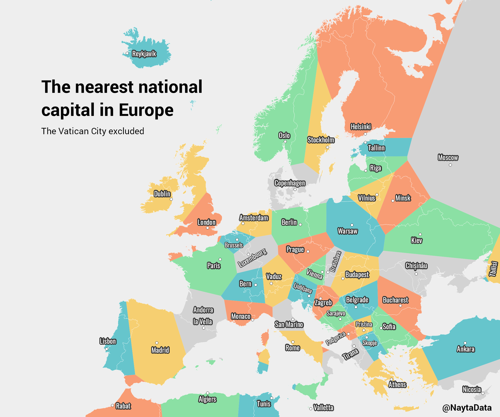
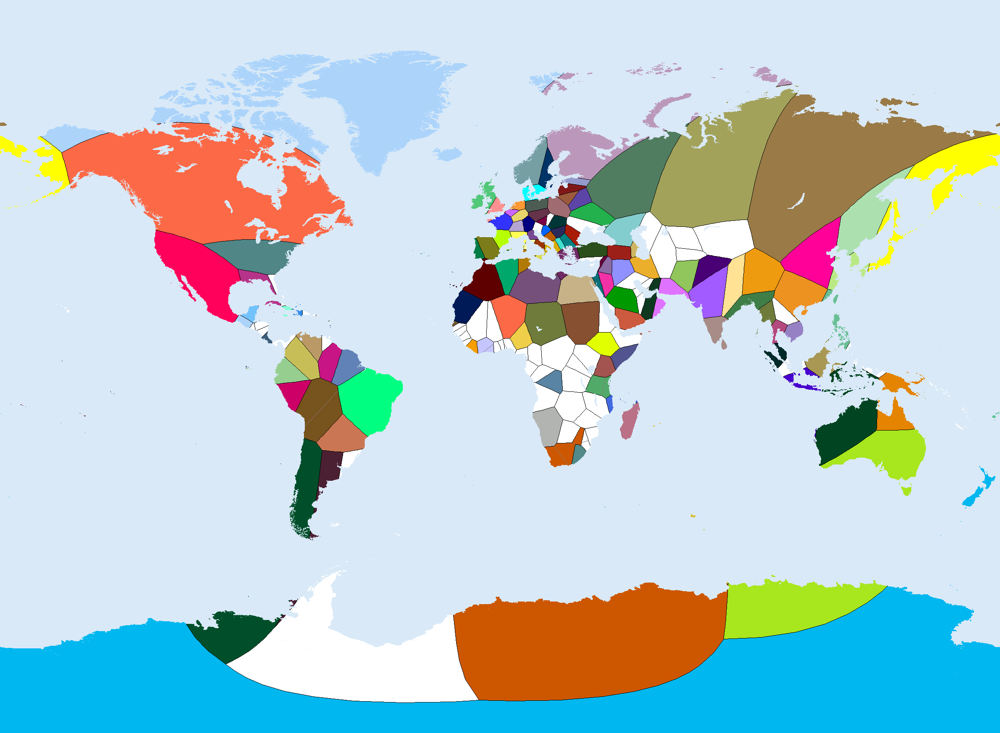
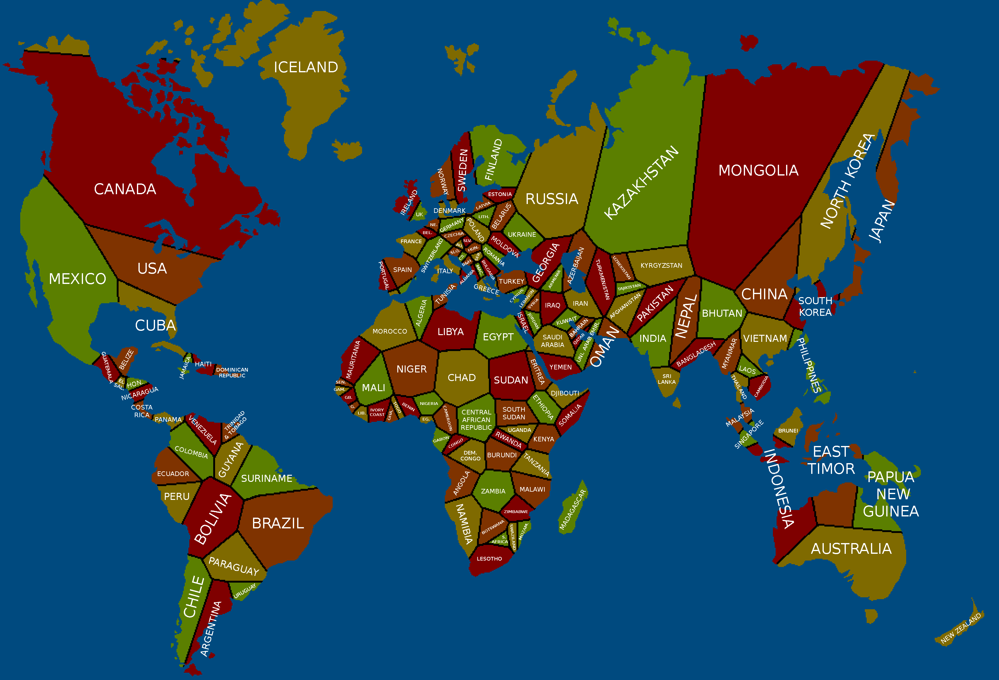

# Diagram Voronoia (Woronoja)

## Opis

[Wikipedia: Voronoi diagram](https://en.wikipedia.org/wiki/Voronoi_diagram)

## Przykłady zastosowania

### Najbliższa stolica (Europa)

### Najbliższa stolica (Świat)

