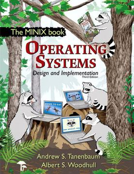

<!-- .slide: data-background="#eee" -->
# Linux

------
# Historia
------
<!-- .slide: data-background="img/pdp-11.jpg" -->
PDP-11
------
<!-- .slide: data-autofragments -->
# UNIX
- 1970s
- Bell Labs
---
<!-- .slide: data-autofragments -->
## Cechy UNIX-a
- wielozadaniowość
- wielodostępność
- hierarchiczny system plików
- pliki tekstowe
---
<!-- .slide: data-background="img/ibm-pc.jpg" -->
---
<!-- .slide: data-autofragments -->
# IBM PC
- 1981
- architektura Intel x86 (8086, 286, 386)
---
<!-- .slide: data-background="img/ms-dos.png" -->
# DOS
------
# Andrew Tanenbaum

---
<!-- .slide: data-autofragments -->
# Minix
- 1987
- *mini Unix*
- prosty, do celów dydaktycznych
---

------
# Linus Torvalds

---
<!-- .slide: data-autofragments -->
# Linux
- 1991
- inspirowany Miniksem
------
# Richard Stallman

---
<!-- .slide: data-background="#eee" -->
# GNU

----
<!-- .slide: data-background="#eee" -->
# GNU GPL

------
<!-- .slide: data-autofragments -->
# POSIX
Portable Operating System Interface
---
<!-- .slide: data-autofragments -->
# POSIX
- procesy
- sygnały
- pliki i katalogi (+operacje)
- standardowa biblioteka C
- I/O
- shell - polecenia
- *etc*
---
<!-- .slide: data-autofragments -->
# POSIX Certified
- Solaris
- macOS
- AIX
- HP-UX
- IRIX
- UnixWare
- QNX Neutrino
---
<!-- .slide: data-autofragments -->
# Prawie POSIX
- Android
- MINIX
- Linux
- BSD (FreeBSD, OpenBSD, NetBSD, Dragonfly BSD)
---
<!-- .slide: data-autofragments -->
# Microsoft Windows?
- POSIX Subsystem
- Cygwin
- Git for Windows
------
<!-- .slide: data-autofragments -->
# API i ABI
- Application Programming Interface
- Application binary Interface
---
# API
- interfejs programistyczny
- kod źródłowy
- protokół komunikacji
- POSIX
---
# ABI
- architektura
- konsolidacja
- konwencja wołania
------
<!-- .slide: data-autofragments -->
<!-- .slide: data-background="#555" -->
# Koniec

dalej: [Dystrybucje Linuksa](Dystrybucje.html)
