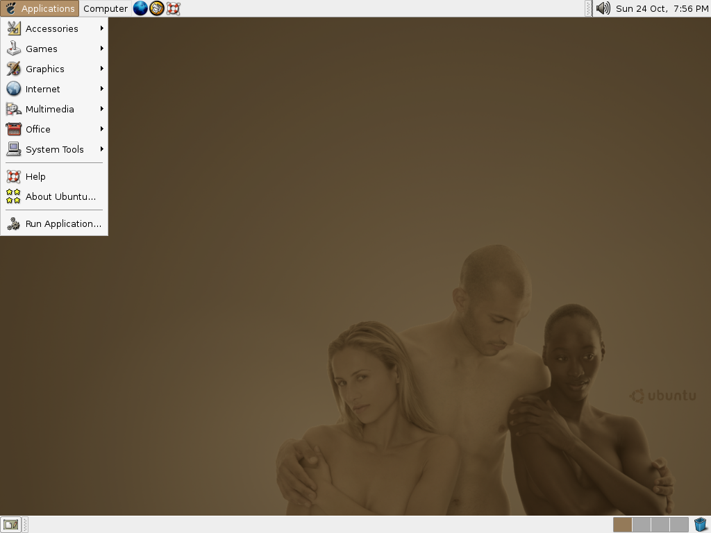
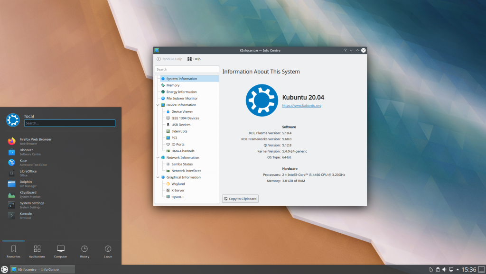
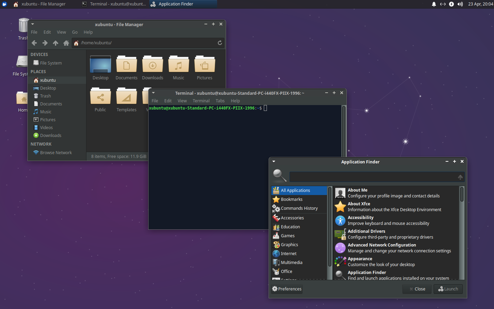
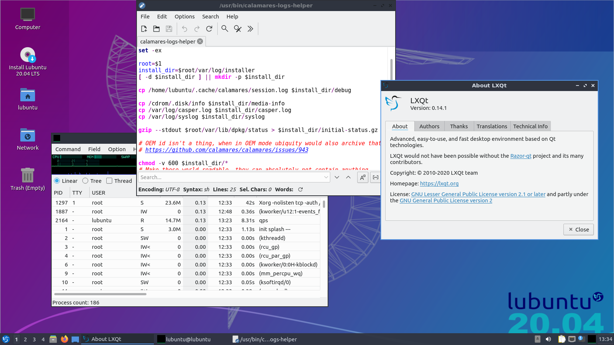

# 25: Debian, Ubuntu

------
## Ian Murdock

1973-2015

- programista

---
<!-- .slide: data-background="#eee" -->

---
<!-- .slide: data-autofragments -->
## Debian Project

- 1993
- całkowicie niekomercyjny
- wolontariusze
- największa baza pakietów (ok. 51 tys.)

------
<!-- .slide: data-autofragments -->
## Mark Shuttleworth

1973-

- informatyk, przedsiębiorca, milioner
- obywatelstwo RPA i UK
- kosmiczny turysta
- developer Debiana

---
<!-- .slide: data-autofragments -->
## 

- wydawca certyfikatów SSL
- kupiony przez Verisign, potem Symantec, Digicert

---
<!-- .slide: data-background="#eee" -->

---
<!-- .slide: data-autofragments -->
## Ubuntu

- bazuje na Debianie
- całkowicie darmowe
- komercyjne wsparcie

---
<!-- .slide: data-autofragments -->
## Canonical

- firma stworzona przez Marka Shuttlewortha
- wydaje Ubuntu
- świadczy usługi dodatkowe: [Ubuntu Pro](https://ubuntu.com/pro), [Landscape](https://ubuntu.com/landscape)

---
## Nazwa

Z afrykańskiego:  
*humanity towards others*

---
## Landscape

narzędzie do webowego zarządzania komputerami

---
## Snapcraft

Dodatkowy menedżer pakietów  
<https://snapcraft.io/>

------
## Ciekawostki o Ubuntu
---
### Ship it

2004-2011

- darmowa wysyłka płyt z Ubuntu
- wersje Live + Installer
- 3 platformy:
  - x86 32-bit
  - x86 64-bit
  - PPC (Macintosh)

---
### Tapety

- użycie aktów
  - na tapetach 
  - w materiałach promocyjnych
- *Linux z gołymi ludźmi*

---
### Nazwa

Żartobliwe tłumaczenie:  
*nie umiem zainstalować Debiana*

------
## Warianty Ubuntu

---
### Ubuntu Server

---
### Kubuntu

---
### Xubuntu

---
### Lubuntu

---
## Inne

- Ubuntu MATE
- Ubuntu Cinnamon Remix
- Ubuntu Studio
- Ubuntu Budgie

------
## Pochodne Ubuntu

- Linux Mint
- Pop! OS
- Elementary OS

------
[Koniec](./)
