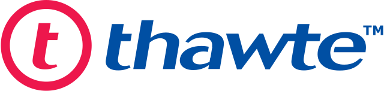

# 25: Debian, Ubuntu

------
## Ian Murdock

- programista
- (1973-2015)

---
<!-- .slide: data-background="#eee" -->

---
<!-- .slide: data-autofragments -->
## Debian Project

- 1993
- całkowicie niekomercyjny
- wolontariusze
- największa baza pakietów (ok. 51 tys.)

------
## Mark Shuttleworth

- informatyk, przedsiębiorca, milioner
- obywatelstwo RPA i UK
- kosmiczny turysta
- developer Debiana
- (1973)

---
<!-- .slide: data-autofragments -->
## 

- wydawca certyfikatów SSL
- później kupiony przez Verisign, potem Symantec, Digicert

---
<!-- .slide: data-background="#eee" -->

---
<!-- .slide: data-autofragments -->
## Ubuntu

- bazuje na Debianie
- komercyjne wsparcie
- całkowicie darmowy

---
<!-- .slide: data-autofragments -->
## Canonical

- firma stworzona przez Marka Shuttlewortha
- wydaje Ubuntu

---
## Nazwa

Z afrykańskiego: *humanity towards others*

---
## Landscape

- narzędzie do webowego zarządzania komputerami

---
## Snapcraft

- Dodatkowy menedżer pakietów
- <https://snapcraft.io/>

------
## Ciekawostki o Ubuntu
---
### Ship it

(2004-2011)

---
### Tapety

---
### Nazwa

Żartobliwe tłumaczenie: *nie umiem zainstalować Debiana*

------
## Warianty Ubuntu

---
### Ubuntu Server

---
### Kubuntu

---
### Xubuntu

---
### Lubuntu

---
### Ubuntu MATE

---
### Ubuntu Cinnamon Remix

---
### Ubuntu Studio

---
### Ubuntu Budgie

------
## Pochodne Ubuntu

---
### Linux Mint

---
### Pop! OS

---
### Elementary OS

------
[Koniec](./)
