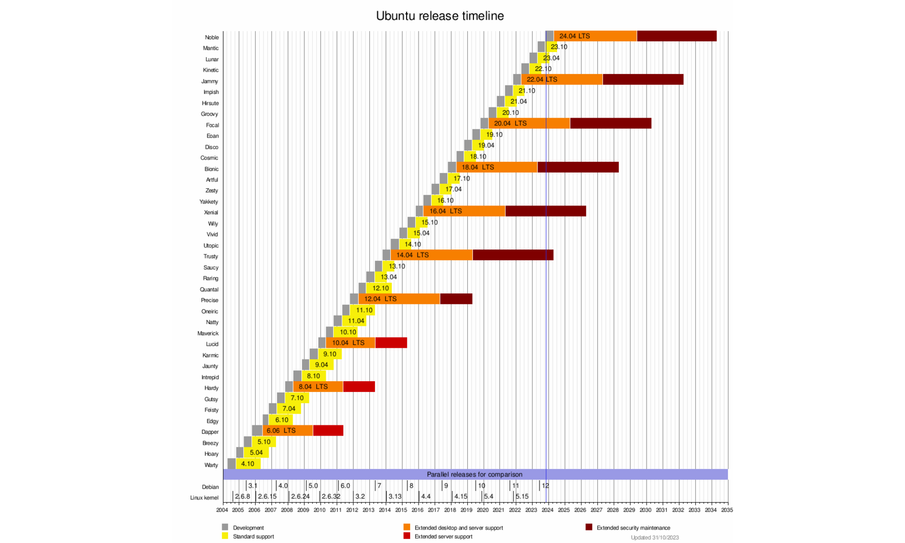
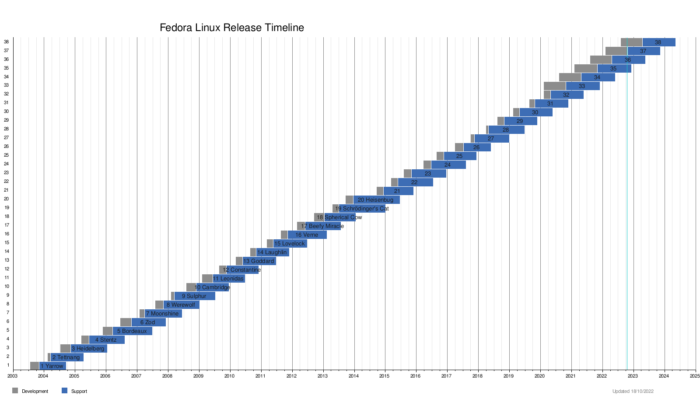
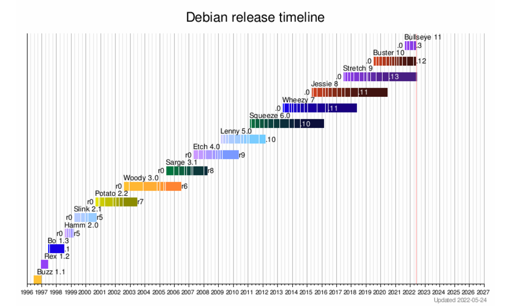

# Dystrybucje Linuksa
---
Dlaczego tak dużo?
- A po co?
- A dlaczego?
- A komu to potrzebne?
---
<iframe style="width: 90vw; height: 70vh;" src="https://www.youtube.com/embed/OO3FANjwKHY?rel=0" title="YouTube video player" frameborder="0" allow="accelerometer; autoplay; clipboard-write; encrypted-media; gyroscope; picture-in-picture" allowfullscreen autoplay></iframe>

------
<!-- .slide: data-autofragments -->
## Różnice
- brand
- wydawca
- cykl wydawniczy
- założenia, przeznaczenie, filozofia
- model licencyjny
- system pakietów
------
<!-- .slide: data-autofragments -->
## Brand
- nazwa
- logo
- kolorystyka
- tapety 😀
---
<!-- .slide: data-background="#eee" -->

---
<!-- .slide: data-background="#eee" -->

---
<!-- .slide: data-background="#434343" -->
 <!-- .element: style="width: 80vw;" -->
---
<!-- .slide: data-background="#eee" -->

---
<!-- .slide: data-background="#eee" -->

---
<!-- .slide: data-background="#eee" -->

---
<!-- .slide: data-background="#eee" -->

---
<!-- .slide: data-background="#eee" -->

---
<!-- .slide: data-background="#eee" -->

---
<!-- .slide: data-background="#eee" -->

---
<!-- .slide: data-background="#eee" -->

Slackware Linux
---
<!-- .slide: data-background="#eee" -->

---
<!-- .slide: data-background="#eee" -->

---
<!-- .slide: data-background="#000" -->
<!-- .slide: style="font-size: 0.3em; color: #fff;" -->
<!-- .slide: data-autofragments -->
## Disclaimer

Product names, logos, and brands are property of their respective owners in the United States and/or other countries.

Author of these slides is not affiliated with any of them and they are used for educational purpuses only.
------
## Nazwy
---
<!-- .slide: data-autofragments -->
## Debian
Imię twórcy i jego żony: Debra + Ian
---
<!-- .slide: data-autofragments -->
## Red Hat® Enterprise Linux®
Od czerwonej czapki, którą nosił twórca.
---
<!-- .slide: data-autofragments -->
## Ubuntu
*humanity towards others*

*nie umiem zainstalować Debiana*
---
<!-- .slide: data-autofragments -->
## Fedora
Typ kapelusza
---
<!-- .slide: data-autofragments -->
## CentOS
Community Enterprise Operating System
---
<!-- .slide: data-autofragments -->
## RockyLinux
Na cześć twórcy CentOS-a: Rocky'ego McGaugha
------
<!-- .slide: data-autofragments -->
## Wydawca
- firma
- instytucja
  - fundacja, NGO, non-profit, etc
  - instytucja rządowa
  - uniwersytet
- niezależni twórcy
---
<!-- .slide: data-autofragments -->
## Wydawcy znanych dystrybucji
- **RHEL**: RedHat, Inc.
- **Ubuntu**: Canonical Ltd.
- **Debian**: Debian Project/Software in the Public Interest (non-profit)
- **RockyLinux**: Rocky Enterprise Software Foundation
- **AlmaLinux**: AlmaLinux OS Foundation
- **Slackware**: Patrick Volkerding (osoba prywatna)
- **Void Linux**: *Void Linux Contributors* (nieformalny zespół wolontariuszy)
------
<!-- .slide: data-autofragments -->
## Cykl wydawniczy
- regularność (lub brak)
- częstotliwość
- czas wsparcia
---
## Cykl ciągły
**rolling release**
------
<!-- .slide: data-autofragments -->
## Ubuntu
- nowe wydania 2 razy w roku
  - kwiecień i październik
- numeracja: `ROK.MIESIĄC` (np. `21.04`)
- nazwy kodowe (gatunki zwierząt + przymiotniki)
- co dwa lata wydanie LTS (Long Term Support)
---
## Dotychczasowe wydania

Ubuntu 4.10 (Warty Warthog)  
Ubuntu 5.04 (Hoary Hedgehog)  
Ubuntu 5.10 (Breezy Badger)  
Ubuntu 6.06 LTS (Dapper Drake)  
Ubuntu 6.10 (Edgy Eft)  
Ubuntu 7.04 (Feisty Fawn)  
Ubuntu 7.10 (Gutsy Gibbon)  
Ubuntu 8.04 LTS (Hardy Heron)  
Ubuntu 8.10 (Intrepid Ibex)  
Ubuntu 9.04 (Jaunty Jackalope)  
Ubuntu 9.10 (Karmic Koala)  
Ubuntu 10.04 LTS (Lucid Lynx)  
Ubuntu 10.10 (Maverick Meerkat)  
Ubuntu 11.04 (Natty Narwhal)  
Ubuntu 11.10 (Oneiric Ocelot)  
Ubuntu 12.04 LTS (Precise Pangolin)  
Ubuntu 12.10 (Quantal Quetzal)  
Ubuntu 13.04 (Raring Ringtail)  
Ubuntu 13.10 (Saucy Salamander)  
Ubuntu 14.04 LTS (Trusty Tahr)  
Ubuntu 14.10 (Utopic Unicorn)  
Ubuntu 15.04 (Vivid Vervet)  
Ubuntu 15.10 (Wily Werewolf)  
Ubuntu 16.04 LTS (Xenial Xerus)  
Ubuntu 16.10 (Yakkety Yak)  
Ubuntu 17.04 (Zesty Zapus)  
Ubuntu 17.10 (Artful Aardvark)  
Ubuntu 18.04 LTS (Bionic Beaver)  
Ubuntu 18.10 (Cosmic Cuttlefish)  
Ubuntu 19.04 (Disco Dingo)  
Ubuntu 19.10 (Eoan Ermine)  
Ubuntu 20.04 LTS (Focal Fossa)  
Ubuntu 20.10 (Groovy Gorilla)  
Ubuntu 21.04 (Hirsute Hippo)  
Ubuntu 21.10 (Impish Indri)  
*Ubuntu 22.04 LTS (Jammy Jellyfish)*  
<!-- .element: style="column-count: 3; font-size: 0.45em;" -->
<!-- .slide: data-background="#5e2750" -->
---
<!-- .slide: data-background="#fff" -->

------
<!-- .slide: data-autofragments -->
## RHEL
- wydania co kilka lat
- numeracja
  - głównych wydań: 6, 7, 8...
  - poprawek: 8.1, 8.2, 8.3...
- tylko wydania z długim wsparciem (ok. 10 lat)
---
<!-- .slide: data-background="#fff" -->

------
<!-- .slide: data-autofragments -->
## Fedora
- wydania średnio dwa razy w roku
- numeracja: 1, 2, ..., 32, 33, 34...
- pole eksperymentalne RedHata
---
<!-- .slide: data-background="#fff" -->

------
<!-- .slide: data-autofragments -->
## Debian
- wydania co kilka lat
- numery + nazwy kodowe
- nazwy - imiona bohaterów bajki *Toy Story*
- **Sid**
---
<!-- .slide: data-background="#fff" -->

© Disney
---
<!-- .slide: data-background="#913" -->
## Dotychczasowe wydania

Debian 1.1 (Buzz)  
Debian 1.2 (Rex)  
Debian 1.3 (Bo)  
Debian 2.0 (Hamm)  
Debian 2.1 (Slink)  
Debian 2.2 (Potato)  
Debian 3.0 (Woody)  
Debian 3.1 (Sarge)  
Debian 4.0 (Etch)  
Debian 5.0 (Lenny)  
Debian 6.0 (Squeeze)  
Debian 7 (Wheezy)  
Debian 8 (Jessie)  
Debian 9 (Stretch)  
Debian 10 (Buster)  
Debian 11 (Bullseye)  
Debian 12 (Bookworm)  
Debian 13 (Trixie)  
<!-- .element: style="column-count: 3; font-size: 0.45em;" -->
---
<!-- .slide: data-background="#fff" -->

------
<!-- .slide: data-autofragments -->
## Klony RHEL

* CentOS
* CentOS Stream
* RockyLinux
* AlmaLinux
* Oracle Linux
---
<!-- .slide: data-autofragments -->
## Dlaczego?

- RHEL - komercyjne wolne oprogramowanie
- ochronie podlega:
  - nazwa i logo
  - skompilowane paczki
- ochronie nie podlega:
  - kod źródłowy

**każdy może legalnie wziąć i wydać swoją wersję**
---
<!-- .slide: data-background="#fff" -->

---
<!-- .slide: data-autofragments -->
## CentOS - różnice

- zmiana nazwy
- zmiana logo
- zmiana kolorów, tapet
- samodzielna kompilacja
- własne repozytoria
---
<!-- .slide: data-autofragments -->
## CentOS

- klon RHEL
- całkowicie kompatybilny
- darmowy
---
<!-- .slide: data-autofragments -->
## CentOS - kalendarium

| wersja | RHEL       | CentOS     | opóźnienie |
|--------|------------|------------|------------|
| 2.1    | 2002-05-17 | 2004-05-14 |        728 |
| 3.1    | 2003-10-23 | 2004-03-19 |        148 |
| 3.3    | 2004-09-03 | 2004-09-17 |         14 |
| ...    | ...        | ...        | ...        |
| 4.0    | 2005-02-14 | 2005-03-09 |         23 |
| 5.0    | 2007-03-14 | 2007-04-12 |         28 |
| 6.0    | 2010-11-10 | 2011-07-10 |        242 |
| 7.0    | 2014-06-10 | 2014-07-07 |         27 |
| 8.0    | 2019-05-07 | 2019-09-24 |        140 |
<!-- .element: style="font-size: 0.55em;" -->
---
<!-- .slide: data-autofragments -->
## Przepływ poprawek

deweloperzy → testerzy → `RHEL` → `CentOS`

- klienci RedHata dostawali poprawki szybciej
- ... również te błędne
- CentOS od razu wdrażał poprawione poprawki
---
<!-- .slide: data-autofragments -->
## CentOS - Fundacja

- z początku niezależna od RedHata
- RedHat Inc. zaproponował finansowanie
- ... w zamian za umieszczenie swoich ludzi w zarządzie
- *what can go wrong?*
---
<!-- .slide: data-autofragments -->
## CentOS Stream

- dodatkowa edycja CentOS-a
- dostawała poprawki przed RHEL
---
<!-- .slide: data-autofragments -->
## CentOS is dead

- decyzja zarządu:
  - zakończenie wsparcia CentOS
  - pozostawienie wspacia CentOS Stream
---
<!-- .slide: data-autofragments -->
## AlmaLinux i RockyLinux

- tylko wersja 8
