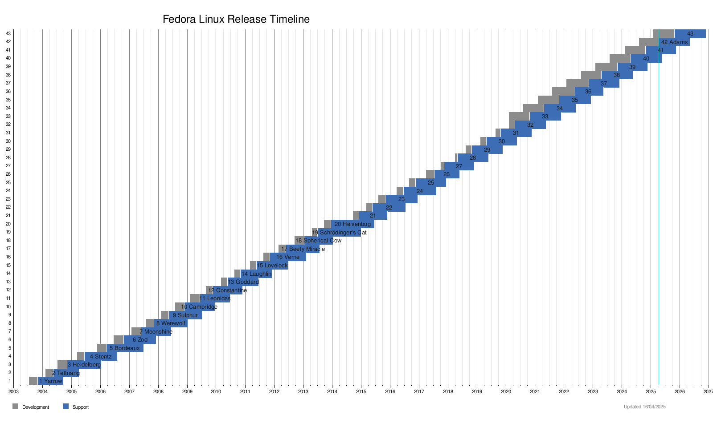

# 20: Dystrybucje Linuksa

---
<!-- .slide: data-autofragments -->
## Ile?

Trudno powiedzieć...

- co jest dystrybucją a co jeszcze nie?
- jak liczyć?

---
<!-- .slide: data-autofragments -->
## Jak liczyć?

- warianty jednej dystrybucji
- nowe i powstające
- zaniechane i porzucone
- wewnętrzne dystrybucje w firmach
- brak rejestru

---
<!-- .slide: data-autofragments -->
## Ale ile?

- [Wikipedia](https://en.wikipedia.org/wiki/Linux_distribution): *Almost one thousand Linux distributions exist.*
- [Distrowatch](https://distrowatch.com/dwres.php?resource=popularity): ok. 270 aktywnych
- [ChatGPT](https://chat.openai.com/): *over 600*
- [Mateusz](https://mateusza-szkolenia.github.io/Sysadmin/Dystrybucje.html): około 50 wartych uwagi

---
<!-- .slide: data-autofragments -->
## Drzewo

<https://upload.wikimedia.org/wikipedia/commons/b/b5/Linux_Distribution_Timeline_21_10_2021.svg>

---
<!-- .slide: data-autofragments -->

## Dlaczego tak dużo?

- *A po co?*
- *A dlaczego?*
- *A komu to potrzebne?*

---
<iframe style="width: 90vw; height: 70vh;" src="https://www.youtube.com/embed/OO3FANjwKHY?rel=0" title="YouTube video player" frameborder="0" allow="accelerometer; autoplay; clipboard-write; encrypted-media; gyroscope; picture-in-picture" allowfullscreen autoplay></iframe>

---
*bo można*

---

 <!-- .element: style="height: 60vh;" -->

------
<!-- .slide: data-autofragments -->
## Różnice

- marka (brand)
- wydawca
- cykl wydawniczy
- założenia, przeznaczenie, filozofia
- model licencyjny
- dobór oprogramowania
- wsparcie i społeczność

------
<!-- .slide: data-autofragments -->
## Marka (brand)

- nazwa
- logo
- kolorystyka
- tapety 😀

---
<!-- .slide: data-background="#eee" -->

---
<!-- .slide: data-background="#eee" -->

---
<!-- .slide: data-background="#434343" -->
 <!-- .element: style="width: 80vw;" -->

---
<!-- .slide: data-background="#eee" -->

---
<!-- .slide: data-background="#eee" -->

---
<!-- .slide: data-background="#eee" -->

---
<!-- .slide: data-background="#eee" -->

---
<!-- .slide: data-background="#eee" -->

---
<!-- .slide: data-background="#eee" -->

---
<!-- .slide: data-background="#eee" -->

---
<!-- .slide: data-background="#eee" -->

---
<!-- .slide: data-background="#eee" -->

Slackware Linux

---
<!-- .slide: data-background="#eee" -->

---
<!-- .slide: data-background="#eee" -->

---
<!-- .slide: data-background="#000" -->
<!-- .slide: style="font-size: 0.3em; color: #fff;" -->
<!-- .slide: data-autofragments -->
## Disclaimer

Product names, logos, and brands are property of their respective owners in the United States and/or other countries.

Author of these slides is not affiliated with any of them and they are used for educational purpuses only.

---
 <!-- .element: style="height: 60vh;" -->

------
## Nazwy

---
<!-- .slide: data-autofragments -->
## Debian

Imię twórcy i jego żony: Debra + Ian

---
<!-- .slide: data-autofragments -->
## Red Hat® Enterprise Linux®

Od czerwonej czapki, którą nosił twórca.

---
<!-- .slide: data-autofragments -->
<!-- .slide: data-auto-animate -->
## Ubuntu

z afrykańskiego: *humanity towards others*

---
<!-- .slide: data-auto-animate -->
## Ubuntu

z afrykańskiego: *nie umiem zainstalować Debiana*

---
<!-- .slide: data-autofragments -->
## Fedora

Typ kapelusza

---
<!-- .slide: data-autofragments -->
## CentOS

Community Enterprise Operating System

---
<!-- .slide: data-autofragments -->
## Rocky Linux

Na cześć Rocky'ego McGaugha (twórcy CentOS)

------
<!-- .slide: data-autofragments -->
## Wydawca

- firma
- instytucja
  - fundacja, NGO, non-profit, etc
  - instytucja rządowa
  - uniwersytet
- niezależni twórcy

---
<!-- .slide: data-autofragments -->
## Wydawcy dystrybucji

- **RHEL**: RedHat, Inc.
- **Ubuntu**: Canonical Ltd.
- **Debian**: Debian Project/Software in the Public Interest (non-profit)
- **Rocky Linux**: Rocky Enterprise Software Foundation
- **AlmaLinux**: AlmaLinux OS Foundation
- **Slackware**: Patrick Volkerding (osoba prywatna)
- **Void Linux**: *Void Linux Contributors* (nieformalny zespół wolontariuszy)
- **Arch Linux**: niezależni twórcy

------
<!-- .slide: data-autofragments -->
## Cykl wydawniczy

- regularność (lub brak)
- okres
- czas wsparcia (poprawki)
- dojrzałość zawartego oprogramowania

---
## Cykl ciągły

**rolling release**

---
## Backports

Nowsze wersje pakietów, wyprzedzające planowane wydania.

------
<!-- .slide: data-autofragments -->
## Ubuntu

- nowe wydania 2 razy w roku  
  (kwiecień i październik)
- numeracja: `ROK.MIESIĄC` (np. `24.04`)
- nazwy kodowe (gatunki zwierząt + przymiotniki)
- co dwa lata LTS  
  (Long Term Support)

---
## Dotychczasowe wydania

Ubuntu 4.10 (Warty Warthog)  
Ubuntu 5.04 (Hoary Hedgehog)  
Ubuntu 5.10 (Breezy Badger)  
Ubuntu 6.06 LTS (Dapper Drake)  
Ubuntu 6.10 (Edgy Eft)  
Ubuntu 7.04 (Feisty Fawn)  
Ubuntu 7.10 (Gutsy Gibbon)  
Ubuntu 8.04 LTS (Hardy Heron)  
Ubuntu 8.10 (Intrepid Ibex)  
Ubuntu 9.04 (Jaunty Jackalope)  
Ubuntu 9.10 (Karmic Koala)  
Ubuntu 10.04 LTS (Lucid Lynx)  
Ubuntu 10.10 (Maverick Meerkat)  
Ubuntu 11.04 (Natty Narwhal)  
Ubuntu 11.10 (Oneiric Ocelot)  
Ubuntu 12.04 LTS (Precise Pangolin)  
Ubuntu 12.10 (Quantal Quetzal)  
Ubuntu 13.04 (Raring Ringtail)  
Ubuntu 13.10 (Saucy Salamander)  
Ubuntu 14.04 LTS (Trusty Tahr)  
Ubuntu 14.10 (Utopic Unicorn)  
Ubuntu 15.04 (Vivid Vervet)  
Ubuntu 15.10 (Wily Werewolf)  
Ubuntu 16.04 LTS (Xenial Xerus)  
Ubuntu 16.10 (Yakkety Yak)  
Ubuntu 17.04 (Zesty Zapus)  
Ubuntu 17.10 (Artful Aardvark)  
Ubuntu 18.04 LTS (Bionic Beaver)  
Ubuntu 18.10 (Cosmic Cuttlefish)  
Ubuntu 19.04 (Disco Dingo)  
Ubuntu 19.10 (Eoan Ermine)  
**Ubuntu 20.04 LTS (Focal Fossa)**  
Ubuntu 20.10 (Groovy Gorilla)  
Ubuntu 21.04 (Hirsute Hippo)  
Ubuntu 21.10 (Impish Indri)  
**Ubuntu 22.04 LTS (Jammy Jellyfish)**  
Ubuntu 22.10 (Kinetic Kudu)  
Ubuntu 23.04 (Lunar Lobster)  
Ubuntu 23.10 (Mantric Minotaur)  
**Ubuntu 24.04 LTS (Noble Numbat)**  
Ubuntu 24.10 Oracular Oriole  
Ubuntu 25.04 Plucky Puffin  
...  
*Ubuntu 25.10 Questing Quokka*  
*Ubuntu 26.04 LTS ...*

<!-- .element: style="column-count: 3; font-size: 0.45em;" -->
<!-- .slide: data-background="linear-gradient(151deg, rgba(2,0,36,1) 3%, rgba(85,30,61,1) 43%, rgba(99,33,69,1) 74%, rgba(156,58,47,1) 94%)" -->

---
<!-- .slide: data-background="#fff" -->

------
<!-- .slide: data-autofragments -->
## RHEL

- wydania co kilka lat
- numeracja
  - głównych wydań: 7, 8, 9...
  - poprawek: 9.1, 9.2, 9.3...
- długie wsparcie (ok. 10 lat)

---
<!-- .slide: data-background="#fff" -->

------
<!-- .slide: data-autofragments -->
## Fedora

- wydania średnio dwa razy w roku
- numeracja: ...37, 38, 39, 40...
- krótkie wsparcie
- pole eksperymentalne RHEL

---
<!-- .slide: data-background="#fff" -->

------
<!-- .slide: data-autofragments -->
## Debian

- wydania co dwa lata
- numery + nazwy kodowe
- nazwy - imiona bohaterów bajki *Toy Story*
- **Sid** - wydanie eksperymentalne

---
<!-- .slide: data-background="#fff" -->

© Pixar, Disney

---
<!-- .slide: data-background="#913" -->
## Dotychczasowe wydania

Debian 1.1 (Buzz)  
Debian 1.2 (Rex)  
Debian 1.3 (Bo)  
Debian 2.0 (Hamm)  
Debian 2.1 (Slink)  
Debian 2.2 (Potato)  
Debian 3.0 (Woody)  
Debian 3.1 (Sarge)  
Debian 4.0 (Etch)  
Debian 5.0 (Lenny)  
Debian 6.0 (Squeeze)  
Debian 7 (Wheezy)  
Debian 8 (Jessie)  
Debian 9 (Stretch)  
Debian 10 (Buster)  
Debian 11 (Bullseye)  
**Debian 12 (Bookworm)**  
⸱⸱⸱  
*Debian 13 (Trixie)*  
*Debian 14 (Forky)*  
⸱⸱⸱  
*Debian Sid*  
<!-- .element: style="column-count: 3; font-size: 0.45em;" -->

---
<!-- .slide: data-background="#fff" -->

------
<!-- .slide: data-autofragments -->
## Klony RHEL

* CentOS
* CentOS Stream
* Rocky Linux
* AlmaLinux
* Oracle Linux
* ...

---
[Pochodne RHEL](Pochodne_RHEL.html)

------
## Android (2008)

------
<!-- .slide: data-autofragments -->
## Dobór oprogramowania

- dojrzałość
- dostępność
- rodzaje licencji
- sterowniki
- wsparcie platform (architektury CPU)
- system pakietów

---
<!-- .slide: data-autofragments -->
## Systemy pakietów

- `deb`
- `RPM`
- inne
  - specyficzne dla dystrybucji
  - niezależne od dystrybucji

------
[Koniec](./)
