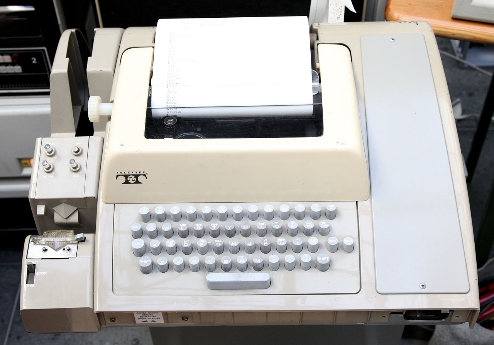
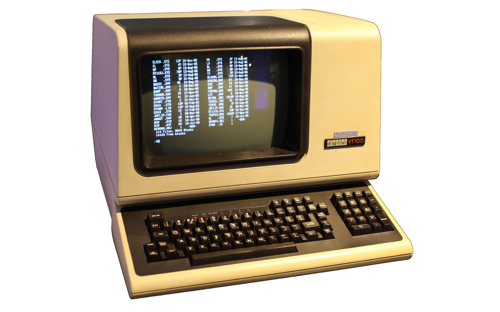
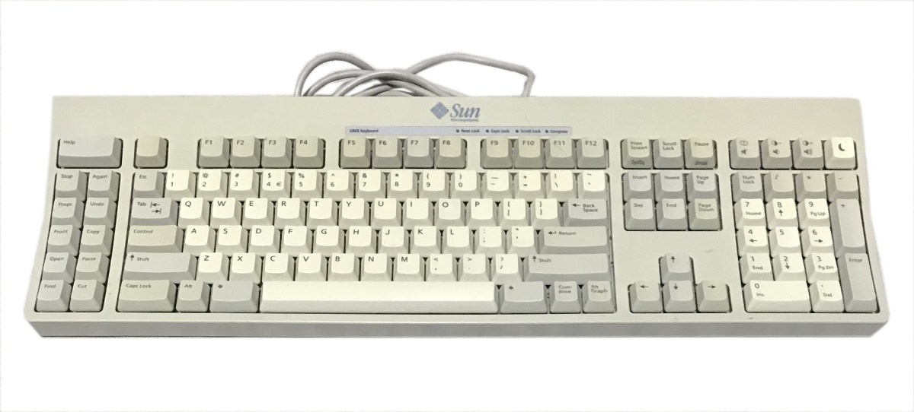

# 70: Edytory

------
## dalekopis (teletype)

---

---
## `ed`

Najprostszy możliwy **edytor**

- działa na dalekopisie (bez monitora)
- nieużywalny dla śmiertelników

---
## `ex`

Rozszerzona (**extened**) wersja `ed`

- minimalnie wygodniejszy
- wciąż nieużywalny dla śmiertelników

------
## terminal z monitorem

- przesuwanie kursora
- edycja linii

---

---
## `vi`

Edytor **wizualny**

- widać edytowany plik

---
## `vi`

- kilka implementacji
- różnice w funkcjonalności

------
## `vim`

*vi improved*

---
## `vi` i `vim`

polecenie `vi` często uruchamia okrojonego **vima**

------
## Obsługa `vi` (`vima`)

2 tryby pracy
- wprowadzanie tekstu
- wydawanie poleceń

------
## inne edytory

---
## `nano` (oraz `pico`)

Przyjemny edytor.

- łatwiejsze skróty klawiszowe
- brak dwóch trybów jak vi

---
## `mcedit`

- zintegrowany z **Midnight Commanderem**

---
## GNU Emacs

*Kombajn*

---
### film hakerzy

<iframe style="width: 60vw; height: 50vh;" src="https://www.youtube.com/embed/wFXLzr86MQ4?rel=0" title="YouTube video player" frameborder="0" allow="accelerometer; autoplay; clipboard-write; encrypted-media; gyroscope; picture-in-picture" allowfullscreen autoplay></iframe>

> Emacsem przez sendmail

---
## `joe`

*(no comment)*

------

