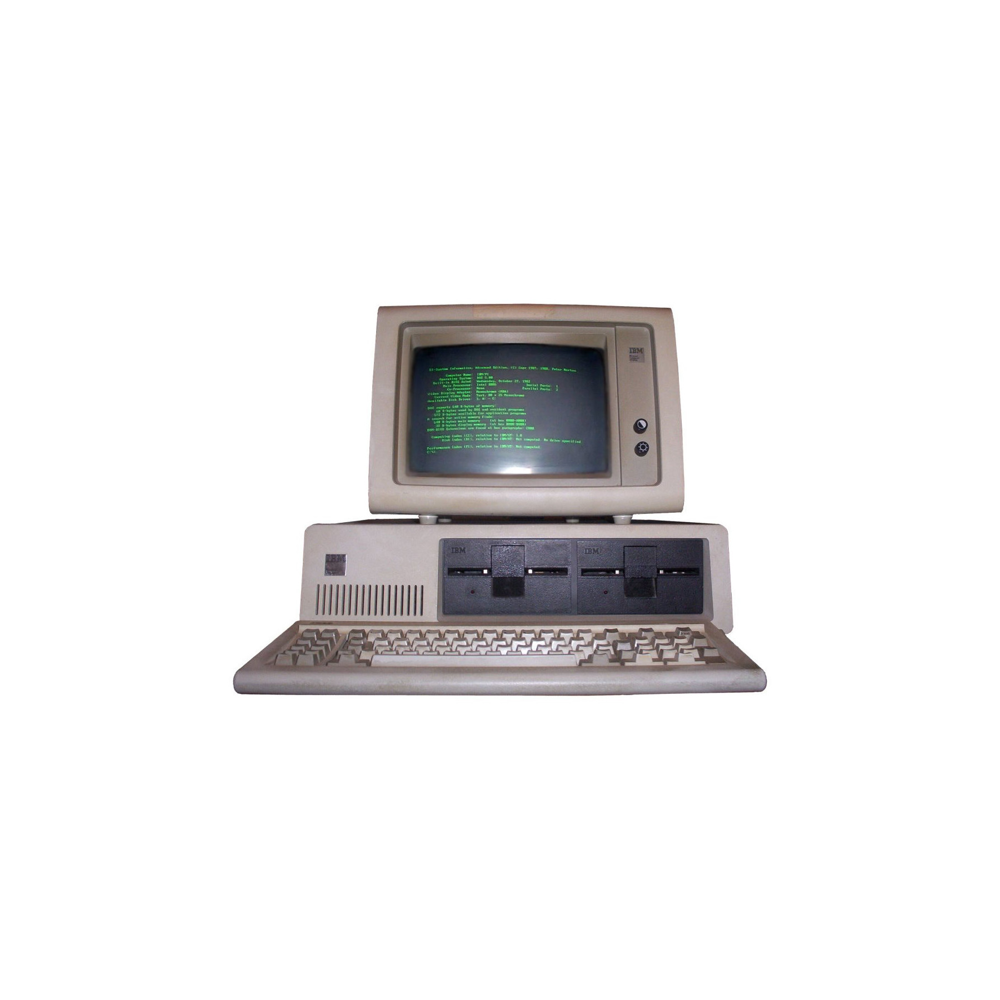
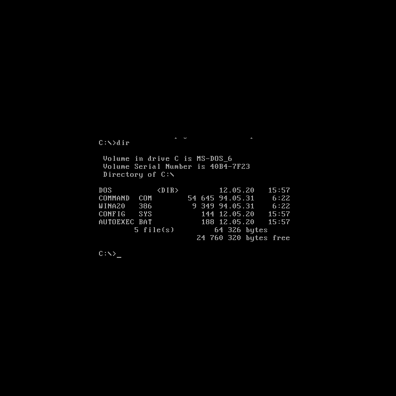
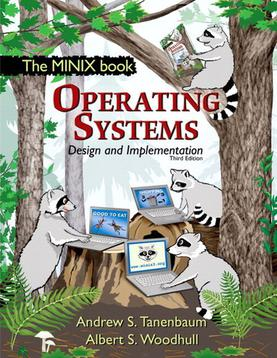
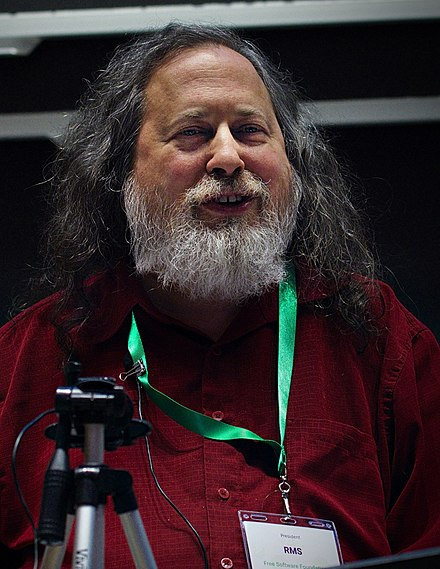
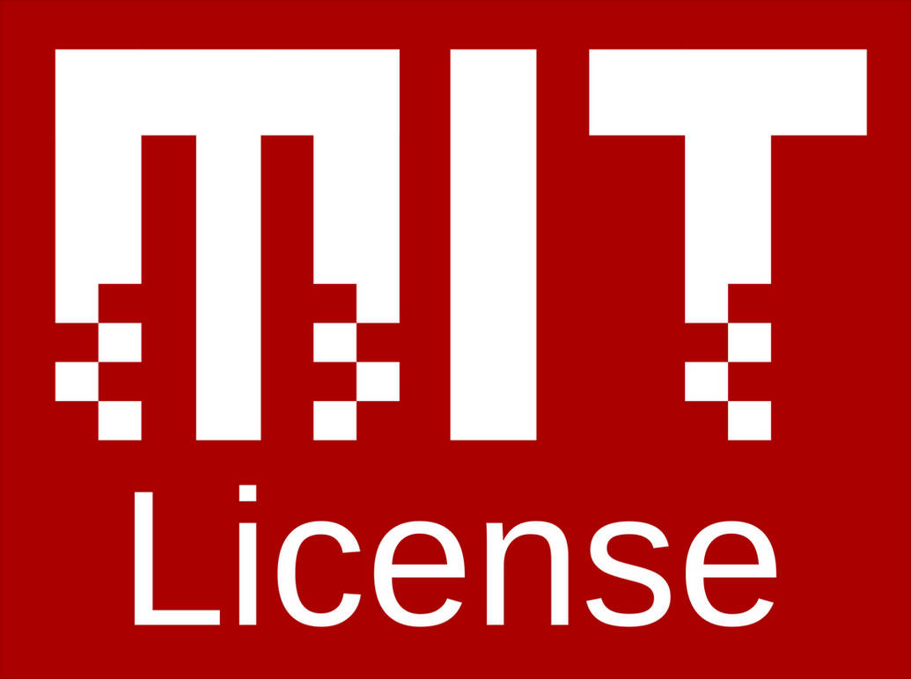
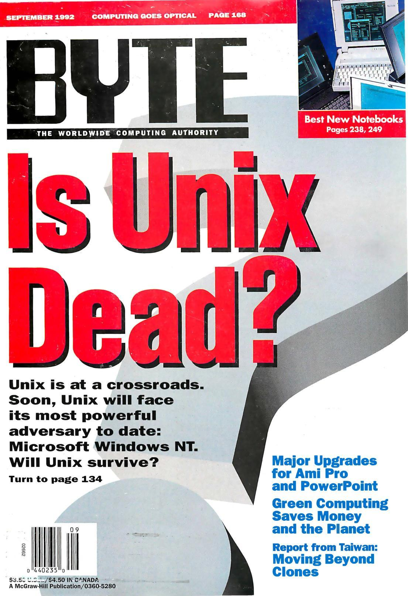
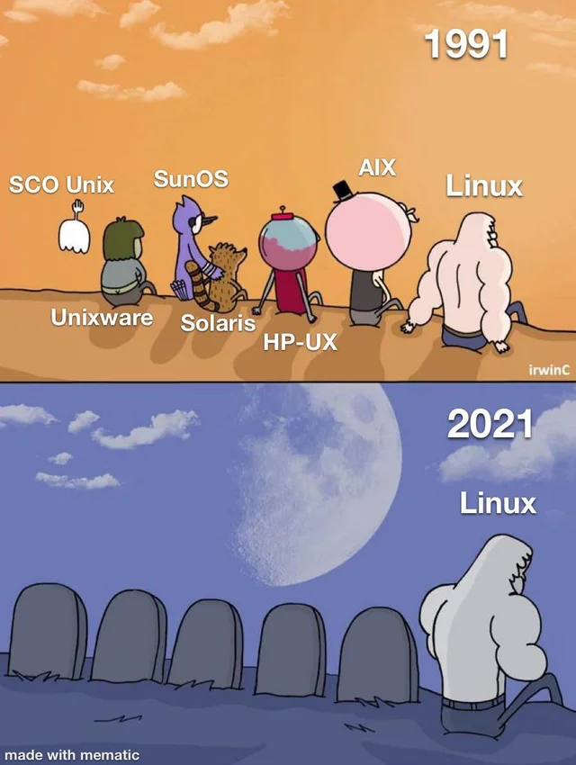
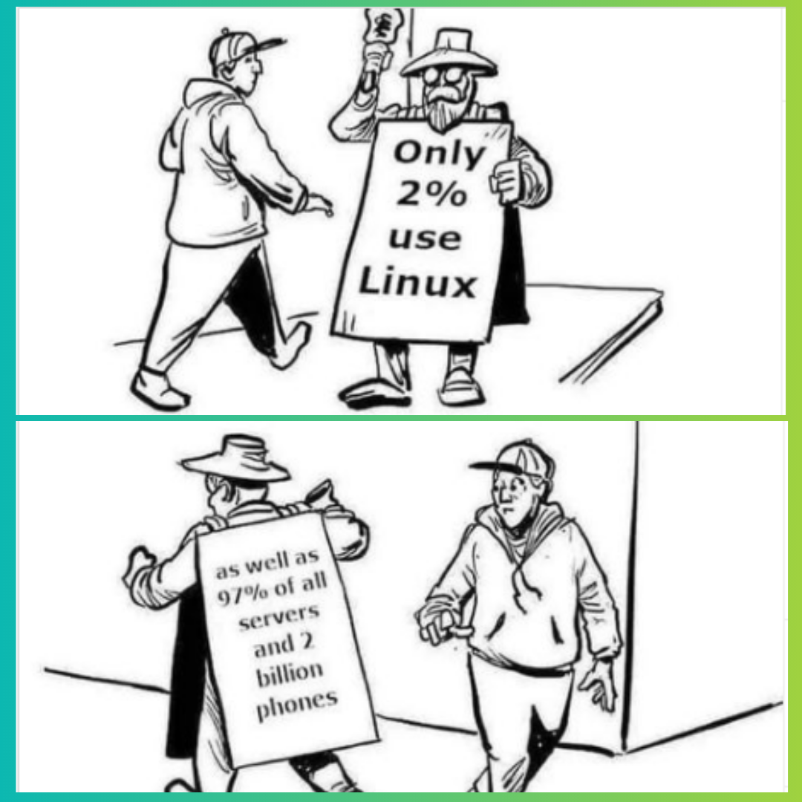
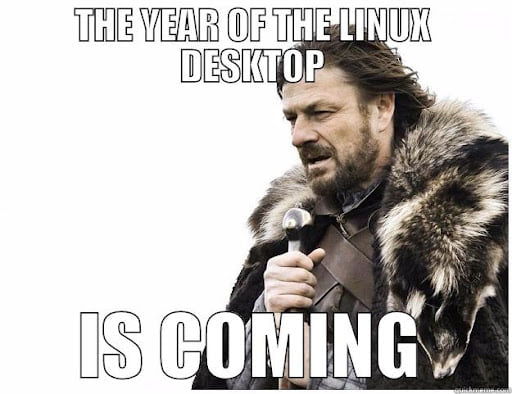

<!-- .slide: data-background="#eee" -->
# 10: Wstęp do Linuksa

---
<!-- .slide: data-background="#eee" -->
 <!-- .element: style="height: 50vh;" -->

------
# Historia

------
<!-- .slide: data-background="img/pdp-11.jpg" -->
PDP-11

------
<!-- .slide: data-autofragments -->
# UNIX (1970...)

- Bell Labs
- język C
- przeznaczenie:
  - centrale telefoniczne
  - _mainframe_ (serwery)

---
<!-- .slide: data-autofragments -->
## Ken Thompson & Dennis Ritchie

<div class='cols cols-2'>
<div>


1943- (KT)  
1941-2011 (DR)

</div>
<div>

- pionierzy informatyki
- twórcy m.in. UNIX-a i C

</div>
</div>

<style> #ken-thompson--dennis-ritchie { font-size: 1.2em; } </style>

---
<!-- .slide: data-autofragments -->
## Cechy UNIX-a

- wielozadaniowość
- wielodostępność
- hierarchiczny system plików
- pliki tekstowe

---
<!-- .slide: data-autofragments -->
## Filozofia UNIX-a

- proste programy wykonujące jedno zadanie
- wynik działania programu łatwy do dalszego przetwarzania
- unikanie plików binarnych
- unikanie interaktywności
- rozbijanie problemów i rozwiązań na mniejsze
- tworzenie narzędzi pomocniczych, w tym generujących kod
- samowystarczalność
- nadrzędność przenośności nad wydajnością

------
<!-- .slide: data-background="img/ibm-pc.jpg" -->

---
<!-- .slide: data-background="#fff" -->
# IBM PC (1981)

<div class='cols cols-2'>
<div>



</div>
<div>

- architektura Intel 8088/x86  
  (8088, 8086, 286, 386...)
- MS-DOS, MS Windows

</div>
</div>

---
<!-- .slide: data-autofragments -->
# DOS (1981)

<div class='cols cols-2'>
<div>



</div>
<div style='font-size: 0.9em'>

- brak wielozadaniowości
- brak wielodostępności
- brak natywnej obsługi sieci
- bezpośredni dostęp do zasobów
- gry, programy

</div>
</div>

------
<!-- .slide: data-autofragments -->
# Andrew Tanenbaum

<div class='cols cols-2'>
<div>


1944-

</div>
<div>

- profesor nauk technicznych
- wykładowca na Wolnym Uniwersytecie w Amsterdamie
- specjalizacja: systemy operacyjne

</div>
</div>

<style> #andrew-tanenbaum { font-size: 1.4em; } </style>

---
<!-- .slide: data-autofragments -->
# Książka "Systemy Operacyjne"

<div class='cols cols-2'>
<div>



</div>
<div>

</div>
</div>

<style> #książka-systemy-operacyjne { font-size: 1.3em; } </style>

---
<!-- .slide: data-autofragments -->
# Minix (1987)

- *mini Unix*
- prosty, do celów dydaktycznych
- dostępny dla 8088, potem x86
- ograniczona licencja

------
<!-- .slide: data-autofragments -->
# Richard Stallman

<div class='cols cols-2'>
<div>



1953-

</div>
<div>

- programista
- aktywista
- działacz społeczny
- filozof

</div>
</div>

---
<!-- .slide: data-autofragments -->
# 4 wolności

- uruchamianie programu w dowolnym celu
- analiza działania i modyfikacja (*open source*)
- rozpowszechnianie
- rozpowszechnianie swoich modyfikacji

---
<!-- .slide: data-background="#fee" -->
## "copyleft"

> @COPYLEFT ALL WRONGS RESERVED

---
> GNU is not in the public domain. Everyone will be permitted to modify and redistribute GNU, but no distributor will be allowed to restrict its further redistribution. That is to say, proprietary modifications will not be allowed. I want to make sure that all versions of GNU remain free.

---
<!-- .slide: data-background="#eee" -->
#  <!-- .element: style="height: 20vh;" -->

*General Public License*

- GPLv1 (1989)
- **GPLv2 (1991)**
- GPLv3 (2007)

---
<!-- .slide: data-background="#ddd" -->
# GNU GPL

<iframe src='assets/gpl-2.0-standalone.html' style='width: 60vw; height: 50vh; outline: .2em solid #dcc; background-color: #eee;'></iframe>

---
<!-- .slide: data-background="#fff" -->
# Licencja MIT

 <!-- .element: style="height: 30vh;" -->

*Massachusetts Institute of Technology* (1980s)

---
<!-- .slide: data-background="#fffaf4" -->
# MIT License

<iframe src='assets/mit.html' style='width: 60vw; height: 50vh; outline: .2em solid #dcc; background-color: #eee;'></iframe>

---
# Inne wolne licencje

- *public domain*
- <abbr title="Lesser GPL">LGPL</abbr>
- <abbr title="Affero GPL">AGPL</abbr>
- BSD License
- Creative Commons
- Apache License
- Mozilla Public License
- Unlicense
- Apple Public Source License
- <abbr title='Do What the Fuck You Want To Public License'>WTFPL</abbr>
- Netscape Public License
- <abbr title=''>ISC</abbr>
- Microsoft Public License

<!-- .element: style="column-count: 2; font-size: 0.75em;" -->

Porównanie licencji: [Wikipedia](https://en.wikipedia.org/wiki/Comparison_of_free_and_open-source_software_licenses)  
Opis licencji prostym językiem: [tl;drLegal](https://www.tldrlegal.com/)

<style> #inne-wolne-licencje { font-size: 1.4em; } </style>

---
<!-- .slide: data-background="#fff" -->
#  <!-- .element: style="height: 20vh;" -->

> Free as in freedom, not free as in free beer

---
<!-- .slide: data-autofragments -->
# Free Software Foundation (1985)

- Wspieranie ruchu wolnego oprogramowania
- Tworzenie oprogramowania
- Tropienie naruszeń licencji GPL
- Walka ze złymi praktykami twórców oprogramowania

<style> #free-software-foundation-1985 { font-size: 1.6em; } </style>

---
<!-- .slide: data-background="#eee" -->
# GNU (1983)

<div class='cols cols-2'>
<div>


GNU is Not Unix

</div>
<div>

- system operacyjny
  - kernel
  - oprogramowanie
  - programy użytkowe

</div>
</div>

---
<!-- .slide: data-autofragments -->
# Oprogramowanie GNU

- kernel: **GNU Mach/GNU Hurd**
- shell: **GNU Bash**
- polecenia: **GNU Coreutils**, **grep**, **tar**
- bootloader: **GRUB**
- kompilatory: **GCC**, **Make**
- biblioteki: **Lib C**, **readline**
- narzędzia: **GnuPG**, **Octave**, **Emacs**, **GDB**
- desktop, aplikacje: **GNOME**, **GIMP**
- [i wiele innych](https://en.wikipedia.org/wiki/List_of_GNU_packages)

<style> #oprogramowanie-gnu { font-size: 1.5em; } </style>

------
<!-- .slide: data-autofragments -->
# Linus Torvalds

<div class='cols cols-2'>
<div>


1969-

</div>
<div>

- szwedzkojęzyczny Fin
- student Uniwersytetu Helsińskiego (w 1991)
- obywatelstwo USA (od 2010)

</div>
</div>

<style> #linus-torvalds { font-size: 1.4em; } </style>

---
## My new operating system

<iframe src='assets/torvalds-email.html' style='width: 60vw; height: 70vh;'></iframe>

---
<!-- .slide: data-autofragments -->
# Linux (1991)

- inspirowany Miniksem  
  (ale nie bazujący na nim)
- główne różnice:
  - architektura kernela
  - licencjonowanie

---
# GNU/Linux

------
<!-- .slide: data-autofragments -->
# POSIX (1988)

IEEE Standard 1003.1

[Portable Operating System Interface](https://en.wikipedia.org/wiki/POSIX)

---
<!-- .slide: data-autofragments -->
# POSIX

- procesy
- sygnały
- pliki i katalogi (+operacje)
- standardowa biblioteka C
- I/O
- shell - polecenia
- *i inne*

---
<!-- .slide: data-autofragments -->
# Certyfikowane z POSIX

- Solaris (SunOS)
- macOS (Apple)
- AIX
- HP-UX
- IRIX
- UnixWare
- QNX Neutrino

<style> #certyfikowane-z-posix {font-size: 1.5em; } </style>

---
<!-- .slide: data-autofragments -->
# Prawie zgodne z POSIX

- MINIX
- Linux
- Android
- BSD (FreeBSD, OpenBSD, NetBSD, Dragonfly BSD)

<style> #prawie-zgodne-z-posix {font-size: 1.5em; } </style>

---
<!-- .slide: data-autofragments -->
# Dlaczego prawie?

- brak formalnej certyfikacji
- minimalne odstępstwa od standardu

---
<!-- .slide: data-autofragments -->
# Microsoft Windows?

- [*POSIX Subsystem*](https://en.wikipedia.org/wiki/Microsoft_POSIX_subsystem)
- [Cygwin](https://www.cygwin.com/)
- [Git for Windows](https://gitforwindows.org/)

<style> #microsoft-windows {font-size: 1.5em; } </style>

------
<!-- .slide: data-background="#eee" -->
#  <!-- .element: style="height: 30vh;" -->

Ranking 500 najpotężniejszych **nierozproszonych** komputerów.

---
<!-- .slide: data-autofragments -->
# Linux na TOP500

- pierwszy raz na liście w 1998
- 100% udziału od 2017
- Unix (w tym BSD): spadek z prawie 100% do 0%
- Windows: w porywach 0.8% (4/500)

\[[1](https://www.top500.org/statistics/details/osfam/1/)\]

---
<!-- .slide: data-background="#eee" -->
# Timeline

 <!-- .element: style="height: 50vh;" -->

<style> #timeline {font-size: 1.3em; } </style>

---
<!-- .slide: data-background="#fff" -->
 <!-- .element: style="height: 50vh;" -->

---
<!-- .slide: data-background="#fff" -->

 <!-- .element: style="height: 50vh;" -->

---
<!-- .slide: data-background="#fff" -->

 <!-- .element: style="height: 50vh;" -->

---
<!-- .slide: data-background="#fff" -->

 <!-- .element: style="height: 50vh;" -->

------
# GNU/Linux Copypasta

> I'd just like to interject for a moment. What you're refering to as Linux, is in fact, GNU/Linux, or as I've recently taken to calling it, GNU plus Linux. Linux is not an operating system unto itself, but rather another free component of a fully functioning GNU system made useful by the GNU corelibs, shell utilities and vital system components comprising a full OS as defined by POSIX.
>
> Many computer users run a modified version of the GNU system every day, without realizing it. Through a peculiar turn of events, the version of GNU which is widely used today is often called Linux, and many of its users are not aware that it is basically the GNU system, developed by the GNU Project.
>
> There really is a Linux, and these people are using it, but it is just a part of the system they use. Linux is the kernel: the program in the system that allocates the machine's resources to the other programs that you run. The kernel is an essential part of an operating system, but useless by itself; it can only function in the context of a complete operating system. Linux is normally used in combination with the GNU operating system: the whole system is basically GNU with Linux added, or GNU/Linux. All the so-called Linux distributions are really distributions of GNU/Linux!

<https://www.gnu.org/gnu/incorrect-quotation.en.html>

<style> #gnulinux-copypasta { font-size: 1em; } 
#gnulinux-copypasta + blockquote p { font-size: 0.5em; line-height: 1.0; text-align: justify; padding: 0.2em; margin: 0.4em; } </style>

------
<!-- .slide: data-autofragments -->
# Pojęcia

- UNIX
- Linux
- GNU/Linux
- dystrybucja Linuksa
  - Ubuntu
  - Red Hat Enterprise Linux

---
<!-- .slide: data-autofragments -->
# Linux

- nazwa oznacza sam kernel:  
  <https://www.kernel.org>

---
<!-- .slide: data-autofragments -->
# GNU/Linux

- system operacyjny z kernelem Linuksa
- oprogramowanie z projektu **GNU**

---
<!-- .slide: data-autofragments -->
# Dystrybucja Linuksa

System operacyjny oparty na Linuksie

- dostosowany do konkretnego zastosowania
- wydany przez konkretny podmiot
- instalator i system pakietów
- usługi dodatkowe
- **niekoniecznie GNU** (np. *Alpine Linux*)

<style> #dystrybucja-linuksa { font-size: 1.4em; } </style>

---
<!-- .slide: data-autofragments -->
# Dystrybucje

Również inne Uniksy i Uniksopodobne

- BSD  
  (FreeBSD, OpenBSD, NetBSD...)
- Solarisy
- ...

---
# Komponenty

```txt
kernel:      v4.4        v4.9        v5.4     v5.16  
init:        systemd     SysVinit    OpenRC   Runit  
pulpit:      GNOME       KDE         MATE     XFCE   
web:         Firefox     Konqueror   Chrome   ...    
shell:       bash        ash         tcsh     zsh    
narzędzia:   coreutils   busybox     ...      ...    
pakiety:     deb         rpm         apk      xbps   
```

<style> #komponenty + pre { font-size: 0.5em; } </style>

---
# Wersje (wydania)

| rok  | dystrybucja  | kernel | GNOME     | GCC  | Python |
|------|--------------|--------|-----------|------|--------|
| 2015 | RHEL 7       | 3.10   | 3.8       | 4.8  | 2.7    |
| 2018 | Ubuntu 18.04 | 4.15   | 3.28      | 7.4  | 3.6    |
| 2019 | RHEL 8       | 4.18   | 3.28      | 8.2  | 3.6    |
| 2020 | Ubuntu 20.04 | 5.4    | 36 (3.36) | 9.0  | 3.8    |
| 2022 | Ubuntu 22.04 | 5.15   | 42 (3.42) | 11.0 | 3.10   |
| 2022 | RHEL 9       | 5.14   | 40 (3.40) | 11.2 | 3.9    |
| 2022 | Ubuntu 22.10 | 5.19   | 43 (3.43) | 12.2 | 3.10   |
| 2024 | Ubuntu 24.04 | 6.8    | 46 (3.46) | 13.0 | 3.12   |

<style> #wersje-wydania + table { font-size: 0.7em; } </style>

---
<!-- .slide: data-background="#fff" -->
 <!-- .element: style="height: 55vh;" -->

------
[Koniec](./)
