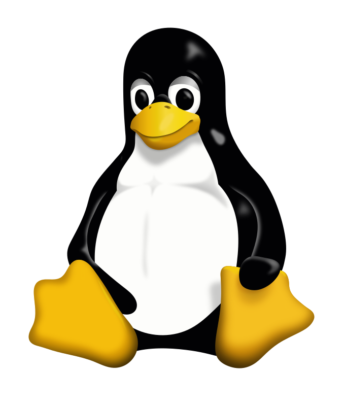
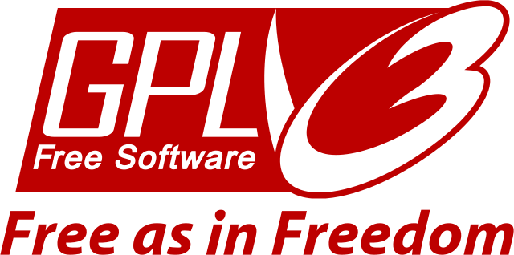

<!-- .slide: data-background="#eee" -->
# Wstęp do Linuksa
---
<!-- .slide: data-background="#eee" -->
 <!-- .element: style="height: 60vh;" -->
------
# Historia
------
<!-- .slide: data-background="img/pdp-11.jpg" -->
PDP-11
------
<!-- .slide: data-autofragments -->
# UNIX

- 1970s
- Bell Labs
- język C
---
<!-- .slide: data-autofragments -->
## Cechy UNIX-a

- wielozadaniowość
- wielodostępność
- hierarchiczny system plików
- pliki tekstowe
------
<!-- .slide: data-background="img/ibm-pc.jpg" -->
---
<!-- .slide: data-autofragments -->
# IBM PC

- 1981
- architektura Intel x86 (8086, 286, 386)
- MS-DOS, MS Windows
---
<!-- .slide: data-background="img/ms-dos.png" -->
---
<!-- .slide: data-autofragments -->
# DOS

- brak wielozadaniowości
- brak wielodostępności
- bezpośredni dostęp do zasobów
- powszechny
- gry, programy
------
# Andrew Tanenbaum

 <!-- .element: style="height: 30vh;" -->
---
<!-- .slide: data-autofragments -->
# Minix

- 1987
- *mini Unix*
- prosty, do celów dydaktycznych
- ograniczenia licencyjne wydawcy
---

------
# Linus Torvalds

---
<!-- .slide: data-autofragments -->
# Linux

- 1991
- inspirowany Miniksem
------
# Richard Stallman

 <!-- .element: style="height: 40vh;" -->
---
<!-- .slide: data-background="#eee" -->
# GNU

 <!-- .element: style="height: 40vh;" -->

*GNU is Not Unix*
---
<!-- .slide: data-background="#eee" -->
# GNU GPL

*GNU General Public License*
------
<!-- .slide: data-autofragments -->
# POSIX

[Portable Operating System Interface](https://en.wikipedia.org/wiki/POSIX)
---
<!-- .slide: data-autofragments -->
# POSIX

- procesy
- sygnały
- pliki i katalogi (+operacje)
- standardowa biblioteka C
- I/O
- shell - polecenia
- *etc*
---
<!-- .slide: data-autofragments -->
# POSIX Certified

- Solaris
- macOS
- AIX
- HP-UX
- IRIX
- UnixWare
- QNX Neutrino
---
<!-- .slide: data-autofragments -->
# Prawie POSIX

- Android
- MINIX
- Linux
- BSD
  
  FreeBSD, OpenBSD, NetBSD, Dragonfly BSD
---
<!-- .slide: data-autofragments -->
# Microsoft Windows?

- POSIX Subsystem
- Cygwin
- Git for Windows
------
<!-- .slide: data-autofragments -->
# API i ABI

- Application Programming Interface
- Application Binary Interface
---
<!-- .slide: data-autofragments -->
# API

- interfejs programistyczny
- kod źródłowy
- protokół komunikacji
- POSIX
---
<!-- .slide: data-autofragments -->
# ABI

- architektura
- konsolidacja
- konwencja wołania
------
<!-- .slide: data-autofragments -->
# Komputer a OS 
---
<!-- .slide: data-autofragments -->
# Rola OS

- dostęp do urządzeń (drivery)
- zarządzanie pamięcią
- zarządzanie procesami
- udostępnienie interfejsu
------
<!-- .slide: data-autofragments -->
# Pojęcia

- Linux
- GNU/Linux
- dystrybucja Linuksa
  - Ubuntu
  - RedHat... etc
---
<!-- .slide: data-autofragments -->
# Linux

- nazwa oznacza sam kernel
- <https://www.kernel.org>
---
<!-- .slide: data-autofragments -->
# GNU/Linux

- system operacyjny z kernelem Linuksa
- oprogramowanie **GNU coreutils**
---
<!-- .slide: data-autofragments -->
# Dystrybucja

- system operacyjny oparty na Linuksie (niekoniecznie GNU):
  - dostosowany do konkretnego zastosowania
  - wydany przez konkretny podmiot
  - z instalatorem i system pakietów
  - usługi dodatkowe
------
<!-- .slide: data-autofragments -->
<!-- .slide: data-background="#555" -->
# Koniec

dalej: [Dystrybucje Linuksa](Dystrybucje.html)

