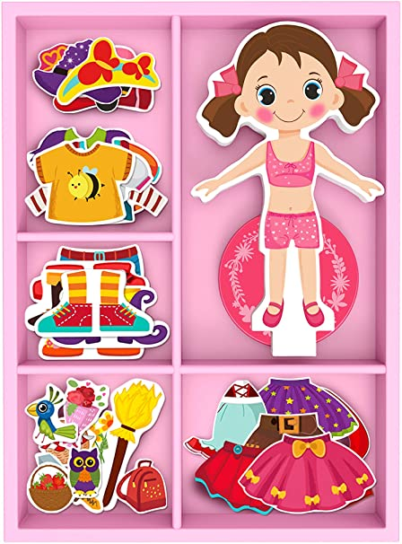

<!-- .slide: data-background="#eee" -->
# 10: Wstęp do Linuksa

---
<!-- .slide: data-background="#eee" -->
 <!-- .element: style="height: 60vh;" -->

------
# Historia

------
<!-- .slide: data-background="img/pdp-11.jpg" -->
PDP-11

------
<!-- .slide: data-autofragments -->
# UNIX

- 1970s
- Bell Labs
- język C

---
## Ken Thompson & Dennis Ritchie

 <!-- .element: style="height: 60vh;" -->
<style> #ken-thompson--dennis-ritchie { font-size: 1.2em; } </style>

---
<!-- .slide: data-autofragments -->
## Cechy UNIX-a

- wielozadaniowość
- wielodostępność
- hierarchiczny system plików
- pliki tekstowe

------
<!-- .slide: data-background="img/ibm-pc.jpg" -->

---
<!-- .slide: data-autofragments -->
# IBM PC

- 1981
- architektura Intel 8088/x86 (8088, 8086, 286, 386)
- MS-DOS, MS Windows

---
<!-- .slide: data-background="img/ms-dos.png" -->

---
<!-- .slide: data-autofragments -->
# DOS

- brak wielozadaniowości
- brak wielodostępności
- brak natywnej obsługi sieci
- bezpośredni dostęp do zasobów
- gry, programy

------
# Andrew Tanenbaum

 <!-- .element: style="height: 60vh;" -->
<style> #andrew-tanenbaum { font-size: 1.1em; } </style>

---
 <!-- .element: style='height: 80vh;' -->

---
<!-- .slide: data-autofragments -->
# Minix

- 1987
- *mini Unix*
- prosty, do celów dydaktycznych
- dostępny dla 8088, potem x86
- ograniczenia licencyjne wydawcy

------
# Linus Torvalds

 <!-- .element: style="height: 60vh;" -->
<style> #linus-torvalds { font-size: 1.1em; } </style>

---
# My new operating system

```
  From: torvalds@klaava.Helsinki.FI (Linus Benedict Torvalds)
  Newsgroups: comp.os.minix
  Subject: What would you like to see most in minix?
  Summary: small poll for my new operating system
  Date: 25 Aug 91 20:57:08 GMT


  Hello everybody out there using minix -

  I'm doing a (free) operating system (just a hobby, won't be big and
  professional like gnu) for 386(486) AT clones.  This has been brewing
  since april, and is starting to get ready.  I'd like any feedback on
  things people like/dislike in minix, as my OS resembles it somewhat
  (same physical layout of the file-system (due to practical reasons)
  among other things).

  I've currently ported bash(1.08) and gcc(1.40), and things seem to work.
  This implies that I'll get something practical within a few months, and
  I'd like to know what features most people would want.  Any suggestions
  are welcome, but I won't promise I'll implement them :-)

                Linus (torvalds@kruuna.helsinki.fi)
```
<style>#my-new-operating-system { font-size: 0.6em; }
#my-new-operating-system + pre { font-size: 0.4em; } </style>

---
<!-- .slide: data-autofragments -->
# Linux

- 1991
- inspirowany Miniksem
  - (ale nie bazujący na nim)
- główne różnice:
  - architektura kernela
  - licencjonowanie

------
# Richard Stallman

 <!-- .element: style="height: 60vh;" -->
<style> #richard-stallman { font-size: 1.1em; } </style>

---
<!-- .slide: data-autofragments -->
# 4 wolności

- uruchamianie programu w dowolnym celu
- analiza działania i modyfikacja (*open source*)
- rozpowszechniania
- rozpowszechniania swoich modyfikacji

---
<!-- .slide: data-background="#eee" -->
# 

*GNU General Public License*

---
<!-- .slide: data-background="#fffaf4" -->
# GNU GPL License

<iframe src='assets/gpl-3.0-standalone.html' style='width: 60vw; height: 50vh;'></iframe>

---
<!-- .slide: data-background="#fff" -->
# Licencja MIT

 <!-- .element: style="height: 50vh;" -->

---
<!-- .slide: data-background="#fffaf4" -->
# MIT License

<iframe src='assets/mit.html' style='width: 60vw; height: 50vh;'></iframe>

---
<!-- .slide: data-background="#fff" -->
#  <!-- .element: style="height: 20vh;" -->

*Free as in freedom, not free as in free beer*

---
<!-- .slide: data-autofragments -->
# Działalność FSF, GNU

- Tworzenie oprogramowania
- Walka ze złymi praktykami twórców oprogramowania
  - [Proprietary Software Is Often Malware](https://www.gnu.org/proprietary/proprietary.html)
    ([Apple](https://www.gnu.org/proprietary/malware-apple.en.html),
     [Microsoft](https://www.gnu.org/proprietary/malware-microsoft.html))
- Tropienie naruszeń licencji GPL

<style> #działalność-fsf-gnu { font-size: 1.6em; } </style>

---
<!-- .slide: data-background="#eee" -->
# GNU

 <!-- .element: style="height: 50vh;" -->

*GNU is Not Unix*

---
<!-- .slide: data-autofragments -->
# Oprogramowanie GNU

- kernel: **GNU Mach/GNU Hurd**
- shell: **GNU Bash**
- polecenia: **GNU Coreutils, grep, tar**
- bootloader: **GRUB**
- kompilatory: **GCC, Make**
- biblioteki: **readline**
- narzędzia: **GnuPG**, **Octave**, **Emacs**
- desktop, aplikacje: **GNOME, GIMP**
- [i wiele innych](https://en.wikipedia.org/wiki/List_of_GNU_packages)

<style> #oprogramowanie-gnu { font-size: 1.5em; } </style>

---
# GNU/Linux

------
<!-- .slide: data-autofragments -->
# POSIX

IEEE Standard 1003.1

[Portable Operating System Interface](https://en.wikipedia.org/wiki/POSIX)

---
<!-- .slide: data-autofragments -->
# POSIX

- procesy
- sygnały
- pliki i katalogi (+operacje)
- standardowa biblioteka C
- I/O
- shell - polecenia
- *i inne*

---
<!-- .slide: data-autofragments -->
# Certyfikowane z POSIX

- Solaris (SunOS)
- macOS (Apple)
- AIX
- HP-UX
- IRIX
- UnixWare
- QNX Neutrino

---
<!-- .slide: data-autofragments -->
# Prawie zgodne z POSIX

- MINIX
- Linux
- Android
- BSD (FreeBSD, OpenBSD, NetBSD, Dragonfly BSD)

---
<!-- .slide: data-autofragments -->
# Dlaczego prawie?

- brak formalnej certyfikacji
- minimalne odstępstwa od standardu

---
<!-- .slide: data-autofragments -->
# Microsoft Windows?

- POSIX Subsystem
- Cygwin
- Git for Windows

------
<!-- .slide: data-background="#eee" -->
#  <!-- .element: style="height: 30vh;" -->

Ranking 500 najpotężniejszych **nierozproszonych** komputerów.

---
<!-- .slide: data-autofragments -->
# Linux na TOP500

- pierwszy raz na liście w 1998
- 100% udziału od 2017
- Unix (w tym BSD): spadek z prawie 100% do 0%
- Windows: w porywach 0.8% (4/500)

\[[1](https://www.top500.org/statistics/details/osfam/1/)\]

---
<!-- .slide: data-background="#eee" -->
# Timeline

 <!-- .element: style="height: 65vh;" -->

<style> #timeline {font-size: 1.3em; } </style>

---
 <!-- .element: style="height: 70vh;" -->

------
<!-- .slide: data-autofragments -->
# API i ABI

- Application Programming Interface
- Application Binary Interface

---
<!-- .slide: data-autofragments -->
# API

- interfejs programistyczny
- kod źródłowy
- protokół komunikacji
- POSIX

---
<!-- .slide: data-autofragments -->
# ABI

- architektura
- konsolidacja
- konwencja wołania

------
<!-- .slide: data-autofragments -->
# Komputer a OS 

---
<!-- .slide: data-autofragments -->
# Rola OS

- dostęp do urządzeń (drivery)
- zarządzanie pamięcią
- zarządzanie procesami
- udostępnienie interfejsu

------
<!-- .slide: data-autofragments -->
# Pojęcia

- Linux
- GNU/Linux
- dystrybucja Linuksa
  - Ubuntu
  - Red Hat Enterprise Linux

---
<!-- .slide: data-autofragments -->
# Linux

- nazwa oznacza sam kernel
- <https://www.kernel.org>

---
<!-- .slide: data-autofragments -->
# GNU/Linux

- system operacyjny z kernelem Linuksa
- oprogramowanie z projektu **GNU**

---
<!-- .slide: data-autofragments -->
# Dystrybucja

System operacyjny oparty na Linuksie (niekoniecznie GNU):

- dostosowany do konkretnego zastosowania
- wydany przez konkretny podmiot
- instalator i system pakietów
- usługi dodatkowe

---
# Komponenty

```txt
kernel:      v4.4        v4.9        v5.4     v5.16  
init:        systemd     SysVinit    OpenRC   Runit  
pulpit:      GNOME       KDE         MATE     XFCE   
web:         Firefox     Konqueror   Chrome   ...    
shell:       bash        ash         tcsh     zsh    
narzędzia:   coreutils   busybox     ...      ...    
pakiety:     deb         rpm         apk      xbps   
```

<style> #komponenty + pre { font-size: 0.5em; } </style>

---
# Wersje (wydania)

| rok  | dystrybucja  | kernel | GNOME | GCC  | Python |
|------|--------------|--------|-------|------|--------|
| 2015 | RHEL 7       | 3.10   | 3.8   | 4.8  | 2.7    |
| 2018 | Ubuntu 18.04 | 4.15   | 3.28  | 7.4  | 3.6    |
| 2019 | RHEL 8       | 4.18   | 3.28  | 8.2  | 3.6    |
| 2020 | Ubuntu 20.04 | 5.4    | 3.36  | 9.0  | 3.8    |
| 2022 | Ubuntu 22.04 | 5.15   | 3.42  | 11.0 | 3.10   |
| 2022 | RHEL 9       | 5.14   | 3.40  | 11.2 | 3.9    |

<style> #wersje-wydania + table { font-size: 0.7em; } </style>

---
<!-- .slide: data-background="#fff" -->
 <!-- .element: style="height: 75vh;" -->

------
[Koniec](./)
