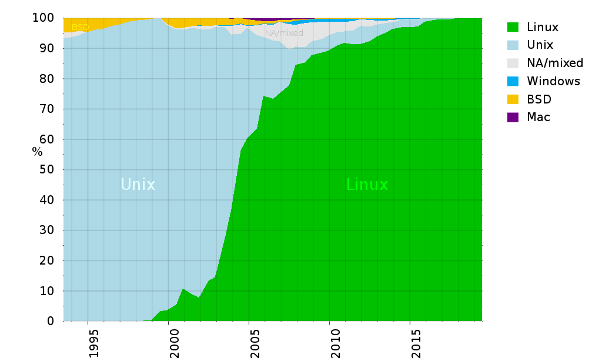
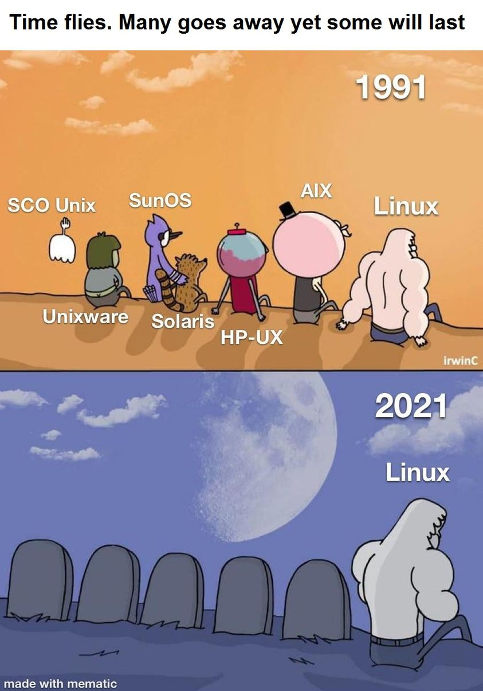

<!-- .slide: data-background="#eee" -->
# 10: Wstęp do Linuksa

---
<!-- .slide: data-background="#eee" -->
 <!-- .element: style="height: 50vh;" -->

------
# Historia

------
<!-- .slide: data-background="img/pdp-11.jpg" -->
PDP-11

------
<!-- .slide: data-autofragments -->
# UNIX (1970...)

- Bell Labs
- język C
- przeznaczenie:
  - centrale telefoniczne
  - serwery

---
## Ken Thompson & Dennis Ritchie

<div class='cols cols-2'>
<div>


</div>
<div>

- pionierzy informatyki
- twórcy m.in. UNIX-a i C
- KT (1943)
- DR (1941-2011)

</div>
</div>

<style> #ken-thompson--dennis-ritchie { font-size: 1.2em; } </style>

---
<!-- .slide: data-autofragments -->
## Cechy UNIXa

- wielozadaniowość
- wielodostępność
- hierarchiczny system plików
- pliki tekstowe

---
<!-- .slide: data-autofragments -->
## Filozofia UNIXa

- proste programy wykonujące jedno zadanie
- wynik działania programu łatwy do dalszego przetwarzania
- unikanie plików binarnych
- unikanie interaktywności
- rozbijanie problemów i rozwiązań na mniejsze
- tworzenie narzędzi pomocniczych, w tym generujących kod
- samowystarczalność
- nadrzędność przenośności nad wydajnością

------
<!-- .slide: data-background="img/ibm-pc.jpg" -->

---
<!-- .slide: data-background="#fff" -->
# IBM PC (1981)

<div class='cols cols-2'>
<div>


</div>
<div>

- architektura Intel 8088/x86  
  (8088, 8086, 286, 386...)
- MS-DOS, MS Windows

</div>
</div>

---
<!-- .slide: data-autofragments -->
# DOS (1981)

<div class='cols cols-2'>
<div>


</div>
<div>

- brak wielozadaniowości
- brak wielodostępności
- brak natywnej obsługi sieci
- bezpośredni dostęp do zasobów
- gry, programy

</div>
</div>

------
<!-- .slide: data-autofragments -->
# Andrew Tanenbaum

<div class='cols cols-2'>
<div>


</div>
<div>

- profesor nauk technicznych
- wykładowca na Wolnym Uniwersytecie w Amsterdamie
- specjalizacja: systemy operacyjne
- (1944)

</div>
</div>

<style> #andrew-tanenbaum { font-size: 1.2em; } </style>

---
 <!-- .element: style="height: 70vh;" -->

---
<!-- .slide: data-autofragments -->
# Minix (1987)

- *mini Unix*
- prosty, do celów dydaktycznych
- dostępny dla 8088, potem x86
- ograniczona licencja

------
# Richard Stallman

<div class='cols cols-2'>
<div>


</div>
<div>

- programista
- aktywista, działacz społeczny
- filozof
- (1953)

</div>
</div>

<style> #richard-stallman { font-size: 1.1em; } </style>

---
<!-- .slide: data-autofragments -->
# 4 wolności

- uruchamianie programu w dowolnym celu
- analiza działania i modyfikacja (*open source*)
- rozpowszechniania
- rozpowszechniania swoich modyfikacji

---
<!-- .slide: data-background="#fffaf4" -->
## "copyleft"

> @COPYLEFT ALL WRONGS RESERVED

---
> GNU is not in the public domain. Everyone will be permitted to modify and redistribute GNU, but no distributor will be allowed to restrict its further redistribution. That is to say, proprietary modifications will not be allowed. I want to make sure that all versions of GNU remain free.

---
<!-- .slide: data-background="#eee" -->
#  <!-- .element: style="height: 20vh;" -->

*General Public License*

- GPLv1 (1989)
- **GPLv2 (1991)**
- GPLv3 (2007)

---
<!-- .slide: data-background="#fffaf4" -->
# GNU GPL

<iframe src='assets/gpl-2.0-standalone.html' style='width: 60vw; height: 50vh;'></iframe>

---
<!-- .slide: data-background="#fff" -->
# Licencja MIT

 <!-- .element: style="height: 30vh;" -->

*Massachusetts Institute of Technology* (1980s)

---
<!-- .slide: data-background="#fffaf4" -->
# MIT License

<iframe src='assets/mit.html' style='width: 60vw; height: 50vh;'></iframe>

---
<!-- .slide: data-autofragments -->
# Inne wolne licencje

- *public domain*
- LGPL i AGPL
- BSD License
- Creative Commons
- Apache License
- Mozilla Public License
- Unlicense
- WTFPL (Do What the Fuck You Want To Public License)

<style> #inne-wolne-licencje { font-size: 1.4em; } </style>

---
<!-- .slide: data-background="#fff" -->
#  <!-- .element: style="height: 20vh;" -->

> Free as in freedom, not free as in free beer

---
<!-- .slide: data-autofragments -->
# Free Software Foundation (1985)

- Wspieranie ruchu wolnego oprogramowania
- Tworzenie oprogramowania
- Tropienie naruszeń licencji GPL
- Walka ze złymi praktykami twórców oprogramowania

<style> #free-software-foundation-1985 { font-size: 1.6em; } </style>

---
<!-- .slide: data-background="#eee" -->
# GNU (1983)
 <!-- .element: style="height: 40vh;" -->

> GNU is Not Unix

---
<!-- .slide: data-autofragments -->
# Oprogramowanie GNU

- kernel: **GNU Mach/GNU Hurd**
- shell: **GNU Bash**
- polecenia: **GNU Coreutils, grep, tar**
- bootloader: **GRUB**
- kompilatory: **GCC, Make**
- biblioteki: **readline**
- narzędzia: **GnuPG**, **Octave**, **Emacs**
- desktop, aplikacje: **GNOME, GIMP**
- [i wiele innych](https://en.wikipedia.org/wiki/List_of_GNU_packages)

<style> #oprogramowanie-gnu { font-size: 1.5em; } </style>

------
<!-- .slide: data-autofragments -->
# Linus Torvalds

<div class='cols cols-2'>
<div>

 <!-- .element: style="height: 50vh;" -->
<style> #linus-torvalds { font-size: 1.4em; } </style>

</div>
<div>

- szwedzkojęzyczny Fin
- w 1991 student Uniwersytetu Helsińskiego
- (1969)

</div>
</div>

---
# My new operating system

```txt
From: torvalds@klaava.Helsinki.FI (Linus Benedict Torvalds)
Newsgroups: comp.os.minix
Subject: What would you like to see most in minix?
Summary: small poll for my new operating system
Date: 25 Aug 91 20:57:08 GMT


Hello everybody out there using minix -

I'm doing a (free) operating system (just a hobby, won't be big and
professional like gnu) for 386(486) AT clones.  This has been brewing
since april, and is starting to get ready.  I'd like any feedback on
things people like/dislike in minix, as my OS resembles it somewhat
(same physical layout of the file-system (due to practical reasons)
among other things).

I've currently ported bash(1.08) and gcc(1.40), and things seem to work.
This implies that I'll get something practical within a few months, and
I'd like to know what features most people would want.  Any suggestions
are welcome, but I won't promise I'll implement them :-)

              Linus (torvalds@kruuna.helsinki.fi)
```
<style>#my-new-operating-system { font-size: 0.6em; }
#my-new-operating-system + pre { font-size: 0.4em; } </style>

---
<!-- .slide: data-autofragments -->
# Linux (1991)

- inspirowany Miniksem
  - (ale nie bazujący na nim)
- główne różnice:
  - architektura kernela
  - licencjonowanie

---
# GNU/Linux

------
<!-- .slide: data-autofragments -->
# POSIX (1988)

IEEE Standard 1003.1

[Portable Operating System Interface](https://en.wikipedia.org/wiki/POSIX)

---
<!-- .slide: data-autofragments -->
# POSIX

- procesy
- sygnały
- pliki i katalogi (+operacje)
- standardowa biblioteka C
- I/O
- shell - polecenia
- *i inne*

---
<!-- .slide: data-autofragments -->
# Certyfikowane z POSIX

- Solaris (SunOS)
- macOS (Apple)
- AIX
- HP-UX
- IRIX
- UnixWare
- QNX Neutrino

<style> #certyfikowane-z-posix {font-size: 1.5em; } </style>

---
<!-- .slide: data-autofragments -->
# Prawie zgodne z POSIX

- MINIX
- Linux
- Android
- BSD (FreeBSD, OpenBSD, NetBSD, Dragonfly BSD)

<style> #prawie-zgodne-z-posix {font-size: 1.5em; } </style>

---
<!-- .slide: data-autofragments -->
# Dlaczego prawie?

- brak formalnej certyfikacji
- minimalne odstępstwa od standardu

---
<!-- .slide: data-autofragments -->
# Microsoft Windows?

- [*POSIX Subsystem*](https://en.wikipedia.org/wiki/Microsoft_POSIX_subsystem)
- [Cygwin](https://www.cygwin.com/)
- [Git for Windows](https://gitforwindows.org/)

<style> #microsoft-windows {font-size: 1.5em; } </style>

------
<!-- .slide: data-background="#eee" -->
#  <!-- .element: style="height: 30vh;" -->

Ranking 500 najpotężniejszych **nierozproszonych** komputerów.

---
<!-- .slide: data-autofragments -->
# Linux na TOP500

- pierwszy raz na liście w 1998
- 100% udziału od 2017
- Unix (w tym BSD): spadek z prawie 100% do 0%
- Windows: w porywach 0.8% (4/500)

\[[1](https://www.top500.org/statistics/details/osfam/1/)\]

---
<!-- .slide: data-background="#eee" -->
# Timeline

 <!-- .element: style="height: 50vh;" -->

<style> #timeline {font-size: 1.3em; } </style>

---
<!-- .slide: data-background="#fff" -->

 <!-- .element: style="height: 50vh;" -->

---
<!-- .slide: data-background="#fff" -->

 <!-- .element: style="height: 50vh;" -->

---
<!-- .slide: data-background="#fff" -->

 <!-- .element: style="height: 50vh;" -->

------
<!-- .slide: data-autofragments -->
# Pojęcia

- UNIX
- Linux
- GNU/Linux
- dystrybucja Linuksa
  - Ubuntu
  - Red Hat Enterprise Linux

---
<!-- .slide: data-autofragments -->
# Linux

- nazwa oznacza sam kernel:  
  <https://www.kernel.org>

---
<!-- .slide: data-autofragments -->
# GNU/Linux

- system operacyjny z kernelem Linuksa
- oprogramowanie z projektu **GNU**

---
<!-- .slide: data-autofragments -->
# Dystrybucja Linuksa

System operacyjny oparty na Linuksie

- dostosowany do konkretnego zastosowania
- wydany przez konkretny podmiot
- instalator i system pakietów
- usługi dodatkowe
- **niekoniecznie GNU** (np. *Alpine Linux*)

<style> #dystrybucja-linuksa { font-size: 1.4em; } </style>

---
# Dystrybucje

Również inne Uniksy i Uniksopodobne

- BSD  
  (FreeBSD, OpenBSD, NetBSD...)
- Solarisy
- ...

---
# Komponenty

```txt
kernel:      v4.4        v4.9        v5.4     v5.16  
init:        systemd     SysVinit    OpenRC   Runit  
pulpit:      GNOME       KDE         MATE     XFCE   
web:         Firefox     Konqueror   Chrome   ...    
shell:       bash        ash         tcsh     zsh    
narzędzia:   coreutils   busybox     ...      ...    
pakiety:     deb         rpm         apk      xbps   
```

<style> #komponenty + pre { font-size: 0.5em; } </style>

---
# Wersje (wydania)

| rok  | dystrybucja  | kernel | GNOME | GCC  | Python |
|------|--------------|--------|-------|------|--------|
| 2015 | RHEL 7       | 3.10   | 3.8   | 4.8  | 2.7    |
| 2018 | Ubuntu 18.04 | 4.15   | 3.28  | 7.4  | 3.6    |
| 2019 | RHEL 8       | 4.18   | 3.28  | 8.2  | 3.6    |
| 2020 | Ubuntu 20.04 | 5.4    | 3.36  | 9.0  | 3.8    |
| 2022 | Ubuntu 22.04 | 5.15   | 3.42  | 11.0 | 3.10   |
| 2022 | RHEL 9       | 5.14   | 3.40  | 11.2 | 3.9    |

<style> #wersje-wydania + table { font-size: 0.7em; } </style>

---
<!-- .slide: data-background="#fff" -->
 <!-- .element: style="height: 55vh;" -->

------
[Koniec](./)
