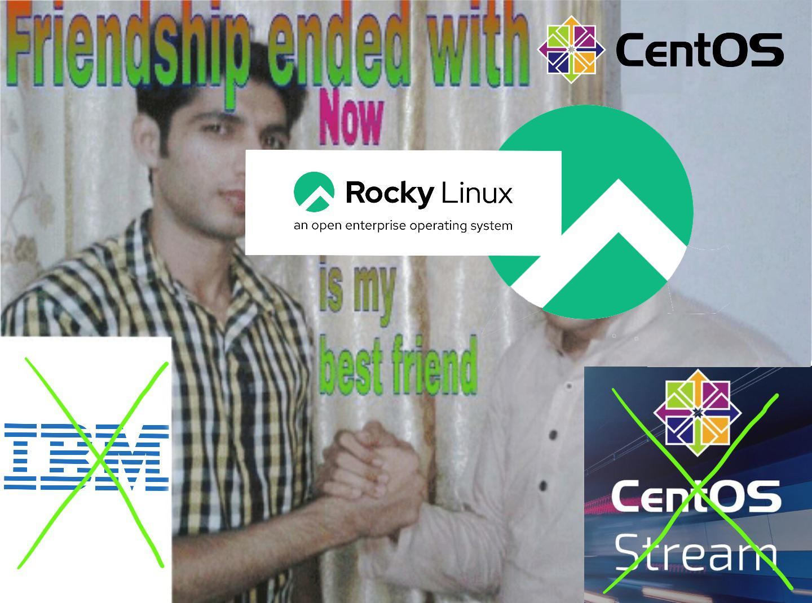

# 24: RHEL i pochodne

------
<!-- .slide: data-autofragments -->
## Klony RHEL

* CentOS
* CentOS Stream
* Rocky Linux
* AlmaLinux
* Oracle Linux
* ...

------
<!-- .slide: data-autofragments -->
## Dlaczego?

RHEL - komercyjne wolne oprogramowanie

---
## Ochronie podlegają

- nazwa i logo
- skompilowane oprogramowanie

---
## Ochronie nie podlega

- kod źródłowy
- dobór oprogramowania

---
**Każdy może legalnie skopiować i wydać swoją wersję.**

---
<!-- .slide: data-background="#fff" -->

------
<!-- .slide: data-autofragments -->
## CentOS (2004)

- klon RHEL
- darmowy
- całkowicie kompatybilny

---
<!-- .slide: data-autofragments -->
## CentOS - różnice

- nazwa, logo, kolorystyka, tapety
- niezależna kompilacja
- własne repozytoria

---
<!-- .slide: data-autofragments -->
## CentOS - kalendarium

| wersja | RHEL       | CentOS     | opóźnienie |
|--------|------------|------------|------------|
| 2.1    | 2002-05-17 | 2004-05-14 |        728 |
| 3.1    | 2003-10-23 | 2004-03-19 |        148 |
| 3.3    | 2004-09-03 | 2004-09-17 |         14 |
| ...    | ...        | ...        | ...        |
| 4.0    | 2005-02-14 | 2005-03-09 |         23 |
| 5.0    | 2007-03-14 | 2007-04-12 |         28 |
| 6.0    | 2010-11-10 | 2011-07-10 |        242 |
| 7.0    | 2014-06-10 | 2014-07-07 |         27 |
| 8.0    | 2019-05-07 | 2019-09-24 |        140 |

<!-- .slide: data-background="linear-gradient(135deg, rgba(255,255,255,1) 0%, rgba(156,207,31,1) 5%, rgba(255,255,255,1) 10%, rgba(241,167,17,1) 15%, rgba(255,255,255,1) 20%, rgba(150,24,122,1) 25%, rgba(255,255,255,1) 30%, rgba(33,32,120,1) 35%, rgba(255,255,255,1) 40%)" -->

------
<!-- .slide: data-autofragments -->
## Przepływ poprawek

deweloperzy → testerzy → RHEL → CentOS

- klienci RedHata dostawali poprawki szybciej
- ... również te niedoskonałe
- CentOS od razu wdrażał poprawione poprawki

---
<!-- .slide: data-autofragments -->
## CentOS - Fundacja

- z początku niezależna od RedHata (2004)
- RedHat Inc. zaproponował finansowanie... (2014)
- ... w zamian za umieszczenie swoich ludzi w zarządzie

*What can go wrong?*

---
<!-- .slide: data-autofragments -->
## CentOS Stream (2019)

- dodatkowa edycja CentOS-a
- dostawała poprawki przed RHEL (tzw. *upstream*)
- poprawki → CentOS Stream → RHEL → CentOS

---
<!-- .slide: data-autofragments -->
## CentOS is dead

Maj 2019: **IBM** kupuje **RedHat, Inc.**

Grudzień 2020: "zarząd" fundacji postanawia:
- zakończenie rozwoju CentOS
- kontynuacja rozwoju CentOS Stream

---
<!-- .slide: data-background="#fff" -->
 <!-- .element: style="height: 60vh;" -->

---
<!-- .slide: data-autofragments -->
## Koniec wsparcia CentOS

| wersja | RHEL       | CentOS     |
|--------|------------|------------|
| ...    | ...        | ...        |
| 6      | 2020-11-30 | 2020-11-30 |
| 7      | 2024-06-30 | 2024-06-30 |
| 8      | 2029-05-01 | 2021-12-31 |
| 9      | 2032-05-01 | ---        |

CentOS Stream - cały czas wspierany

------
<!-- .slide: data-autofragments -->
<!-- .slide: data-background="#fff" -->
## AlmaLinux i Rocky Linux

Tylko wersje od 8.3 wzwyż.

---

*Rocky Linux is an open-source enterprise operating system designed to be 100% bug-for-bug compatible with Red Hat Enterprise Linux®.*

---
## kalendarium AlmaLinux

| wersja | RHEL       | AlmaLinux  | opóźnienie |
|--------|------------|------------|------------|
| 8.3    | 2020-11-03 | 2021-03-30 |        147 |
| 8.7    | 2022-11-09 | 2022-11-10 |          1 |
| 8.8    | 2023-05-16 | 2023-05-18 |          2 |
| 8.9    | 2023-11-14 | 2023-11-21 |          7 |
| 8.10   | 2024-05-22 | 2024-05-28 |          6 |
| 9.0    | 2022-05-17 | 2022-05-26 |          9 |
| 9.4    | 2024-04-30 | 2024-05-06 |          6 |
| 9.5    | 2024-11-13 | 2024-11-18 |          5 |

[źródło](https://en.wikipedia.org/wiki/AlmaLinux#Releases)

<!-- .slide: data-background="linear-gradient(227deg, rgba(47,136,188,1) 5%, rgba(253,229,47,1) 9%, rgba(207,78,42,1) 57%, rgba(202,37,42,1) 61%, rgba(202,37,42,1) 75%, rgba(153,39,77,1) 78%, rgba(44,30,85,1) 100%)" -->

---
## kalendarium Rocky Linux

| wersja | RHEL       | Rocky Linux| opóźnienie |
|--------|------------|------------|------------|
| 8.3    | 2020-11-03 | ...        |        ... |
| 8.4    | 2021-05-18 | 2021-06-21 |         34 |
| 8.9    | 2023-11-14 | 2023-11-22 |          8 |
| 8.10   | 2024-05-22 | 2024-05-30 |          8 |
| 9.0    | 2022-05-17 | 2022-07-15 |         58 |
| 9.4    | 2024-04-30 | 2024-05-09 |          9 |
| 9.5    | 2024-11-12 | 2024-11-19 |          7 |

[źródło](https://en.wikipedia.org/wiki/Rocky_Linux#Releases)

<!-- .slide: data-background="linear-gradient(120deg, rgba(17,17,20,1) 53%, rgba(0,187,130,1) 82%, rgba(0,187,130,1) 93%, rgba(17,17,20,1) 95%)" -->
------
# "Closed source"

Czerwiec 2023:  
RedHat podejmuje decyzję o niepublikowaniu kodu źródłowego.

Kod źródłowy tylko dla płacących klientów.

---
# Przyszłość?

Maj 2024:  
Rocky Linux i AlmaLinux wydają wersje 8.10 i 9.4.

...

------
[Powrót do dystrybucji](Dystrybucje.html#/10/1)

[Koniec](./)

