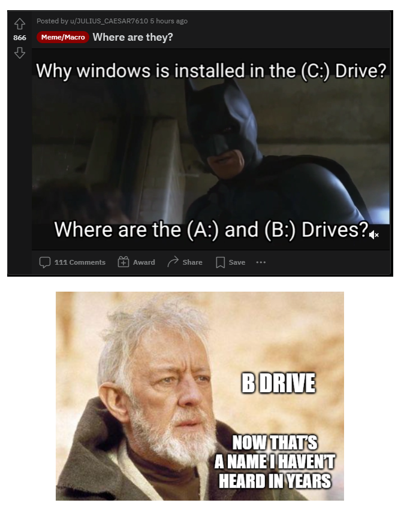

# 30: System plików w Linuksie

------
## Struktura składowania danych

  <i class='fa fa-file'></i> 
  plik

  <i class='fa fa-folder'></i> 
  katalog (folder)

---
<!-- .slide: data-autofragments -->
## Drzewo katalogów

- katalogi zawierają pliki i katalogi
- obiekty w katalogu mają unikalne nazwy

---
<!-- .slide: data-background="#05a" -->
Uwaga: *(prawie) wszystko jest plikiem*

---
<!-- .slide: data-autofragments -->
## Pliki

- zwykłe
- *niezwykłe* (specjalne)
  - rurki (pipe)
  - gniazda (socket)
  - łącza symboliczne (symlink)
  - urządzenia (device)

---
<!-- .slide: data-autofragments -->
## Pliki zwykłe

- przechowują:
  - *dokumenty*, dane
  - obrazki, zdjęcia, multimedia
  - programy
- mają rozmiar (bajty)
- znaczniki czasu i inne meta-dane

---
<!-- .slide: data-autofragments -->
## pipe (rurka)

- inna nazwa: FIFO
- kolejka
- komunikacja 1-do-1 między procesami (jednokierunkowa)
- zerowy rozmiar na dysku

---
<!-- .slide: data-autofragments -->
## socket (gniazdo)

- komunikacja 1-do-wielu
- odpowiednik łączności TCP/IP, ale bez stosu sieciowego
- zerowy rozmiar na dysku

---
<!-- .slide: data-autofragments -->
## device (urządzenie)

- komunikacja między procesami a urządzeniami obsługiwanymi przez sterownik kernela
- tylko w katalogu `/dev/`
- zerowy rozmiar na dysku
- identyfikacja urządzeń:
  - dwie liczby całkowite (*major*, *minor*)

---
<!-- .slide: data-autofragments -->
## symbolic link

- może wskazywać na plik lub katalog
- przypomina "Skrót" z Windows
- rozmiar: długość napisu ze ścieżką

---
<!-- .slide: data-autofragments -->
## katalogi

- służą organizacji danych
- mogą zawierać inne pliki i katalogi
- mogą być *wirtualne*
- są specjalnym rodzajem pliku

------
<!-- .slide: data-autofragments -->
<!-- .slide: data-background="#eee" -->
## Różnice <i class='fab fa-linux'></i> vs <i class='fab fa-windows'></i>

- wielkość liter
- dozwolone znaki i nazwy
- ścieżki: dysk i ukośniki
- rozszerzenia i typy plików
- uprawnienia i pliki ukryte
- pliki specjalne
- znak końca linii w plikach tekstowych
- operacje i mechanizmy blokowania

------
<!-- .slide: data-autofragments -->
<!-- .slide: data-background="#eee" -->
## Wielkość liter

  <i class='fab fa-windows fa-3x'></i> 
  bez znaczenia

  <i class='fab fa-linux fa-3x'></i> 
  ma znaczenie

---
<!-- .slide: data-autofragments -->
<!-- .slide: data-background="#eee" -->
### Przykład

<i class='fa fa-file'></i> ala.txt

<i class='fa fa-file'></i> ALA.txt

<i class='fa fa-file'></i> Ala.txt

<i class='fa fa-file'></i> Ala.TXT

  <h3 class='fragment'><i class='fab fa-windows'></i></h3>
  <ul>
  <li>ta sama nazwa</li>
  <li>nie mogą być w jednym katalogu</li>
  </ul>

  <h3 class='fragment'><i class='fab fa-linux'></i></h3>
  <ul>
  <li>4 różne nazwy</li>
  <li>mogą być w jednym katalogu</li>
  </ul>

------
<!-- .slide: data-autofragments -->
<!-- .slide: data-background="#eee" -->
## Niedozwolone znaki

  <h3 class='fragment'><i class='fab fa-windows fa-3x'></i></h3>
  
drukowalne:  <code style='font-size: 0.7em;'>/ \ | * : < > ? "</code>

  
niedrukowalne:  <code>ASCII 0-31</code>

  <h3 class='fragment'><i class='fab fa-linux fa-3x'></i></h3>
  
drukowalne:  <code>/</code>

  
niedrukowalne:  <code>ASCII 0</code>

------
<!-- .slide: data-autofragments -->
<!-- .slide: data-background="#eee" -->
## Zastrzeżone nazwy

  <h3 class='fragment'><i class='fab fa-windows fa-3x'></i></h3>
  

  <code>con</code> 
  <code>nul</code> 
  <code>com1</code> 
  <code>lpt1</code> 
  <i>i inne...</i> 
  (również z dowolnym rozszerzeniem)
  

  <h3 class='fragment'><i class='fab fa-linux fa-3x'></i></h3>
  
brak ograniczeń

------
<!-- .slide: data-autofragments -->
<!-- .slide: data-background="#eee" -->
## Drzewo katalogów

  <h3 class='fragment'><i class='fab fa-windows'></i></h3>
  <ul>
  <li>osobne dla każdego dysku</li>
  <li>rzeczywiste pliki</li>
  <li>ew. dyski sieciowe</li>
  </ul>

  <h3 class='fragment'><i class='fab fa-linux'></i></h3>
  <ul>
  <li>jedno wirtualne drzewo (VFS)</li>
  <li>rzeczywiste pliki tylko w niektórych gałęziach</li>
  <li>również pliki i katalogi wirtualne</li>
  </ul>

------
<!-- .slide: data-autofragments -->
<!-- .slide: data-background="#eee" -->
## Dyski

  <h3 class='fragment'><i class='fab fa-windows'></i></h3>
  
<i class='fa fa-hdd'></i> C:

  
<i class='fa fa-hdd'></i> D:

  
<i class='fa fa-hdd'></i> E:

  <h3 class='fragment'><i class='fab fa-linux'></i></h3>
  
<i class='fa fa-hdd'></i> /dev/sda

  
<i class='fa fa-hdd'></i> /dev/sda2

  
wymagają montowania...

---
<!-- .slide: data-background="#fff" -->
 <!-- .element: style="height: 50vh;" -->

------
<!-- .slide: data-autofragments -->
<!-- .slide: data-background="#eee" -->
## Separatory

<i class='fab fa-linux'></i> slash <code> / </code>

<i class='fab fa-windows'></i> backslash <code> \ </code>

---
<!-- .slide: data-autofragments -->
<!-- .slide: data-background="#eee" -->
## Ścieżki

<i class='fab fa-linux'></i> <code>/home/mateusz/Desktop</code>

<i class='fab fa-windows'></i> <code>C:\Users\mateusz\Desktop</code>

---
<!-- .slide: data-autofragments -->
<!-- .slide: data-background="#05a" -->
### Uwagi dot. slasha i backslasha

- w Windows można używać slasha zamiast backslasha
- `C:/Windows/System32` zadziała

---
<!-- .slide: data-autofragments -->
<!-- .slide: data-background="#eee" -->
### Zastosowanie slasha `/`

- ścieżki w Linuksie, Uniksach, macOS
- URL-e:  
  `https://alx.pl/`
- zamykanie znaczników HTML:  
  `<h1>Tytuł</h1>`
- znak dzielenia w programowaniu:  
  `1 / 3`

---
<!-- .slide: data-autofragments -->
<!-- .slide: data-background="#eee" -->
### Zastosowanie backslasha `\`

- ścieżki w Windows (oraz Symbian i UEFI)
- *eskejpowanie*:  
  `printf("Hello, world.\n");`
- znaczniki LaTeX-a:  
  `\begin{article}`

------
<!-- .slide: data-autofragments -->
<!-- .slide: data-background="#eee" -->
## Rozszerzenia i typy plików

<i class='fa fa-file-audio'></i> piosenka.mp3

<i class='fa fa-file-pdf'></i> raport.pdf

<i class='fa fa-file-word'></i> cv.docx

<i class='fa fa-file-image'></i> wakacje.jpg

<i class='fa fa-file-archive'></i> różne.zip

<i class='fa fa-file-excel'></i> wydatki.xlsx

---
<!-- .slide: data-autofragments -->
<!-- .slide: data-background="#eee" -->
## Nazwa i rozszerzenie

  <h3 class='fragment'><i class='fab fa-windows'></i></h3>
  <ul>
  <li>rozszerzenie i nazwa to dwie odrębne części</li>
  <li>znane rozszerzenia domyślnie niewidoczne</li>
  </ul>

  <h3 class='fragment'><i class='fab fa-linux'></i></h3>
  <ul>
  <li>brak formalnego podziału</li>
  <li>kropka - dozwolony znak w nazwie</li>
  <li>rozszerzenia zawsze widoczne</li>
  </ul>

---
<!-- .slide: data-autofragments -->
<!-- .slide: data-background="#eee" -->
## Rozszerzenia i typy plików

<i class='fa fa-file-audio'></i> piosenka.mp3

---
<!-- .slide: data-autofragments -->
<!-- .slide: data-background="#eee" -->
## Interpretacja Windowsowa

<i class='fa fa-file-audio'></i> piosenka

- nazwa pliku: `piosenka`
- rozszerzenie: `mp3` (niewidoczne)
- typ pliku: muzyka (MPEG-1/2 Audio Layer 3)
- (typ wynika z rozszerzenia)

---
<!-- .slide: data-autofragments -->
<!-- .slide: data-background="#eee" -->
## Interpretacja Linuksowa

<i class='fa fa-file-audio'></i> piosenka.mp3

- nazwa pliku: `piosenka.mp3`
- rozszerzenie: `.mp3` (umowne)
- typ pliku: muzyka (MPEG-1/2 Audio Layer 3)
- (typ może też wynikać z zawartości)

------
<!-- .slide: data-autofragments -->
<!-- .slide: data-background="#eee" -->
## "Nietypowe" nazwy plików w Linuksie

<table style='font-size: 0.8em;'>
<tr class=fragment>
<th>nazwa pliku</th>
<th>uwagi</th>
</tr>
<tr class=fragment>
<td><i class='fa fa-file'></i> <code>hosts</code></td>
<td>brak rozszerzenia</td>
</tr>
<tr class=fragment>
<td><i class='fa fa-file'></i> <code>.bash_history</code></td>
<td>kropka na początku</td>
</tr>
<tr class=fragment>
<td><i class='fa fa-file'></i> <code>archiwum.tar.bz2</code></td>
<td>kilka rozszerzeń</td>
</tr>
<tr class=fragment>
<td><i class='fa fa-file'></i> <code>libpng15.so.15.13.0</code></td>
<td>rozszerzenie <code>.so</code> w środku</td>
</tr>
</table>

------
<!-- .slide: data-autofragments -->
<!-- .slide: data-background="#eee" -->
## Przenośność plików

Ograniczenia w Windows:
- nie zawsze są ograniczeniami systemu plików
- zaimplementowane niekonsekwentnie
- mogą powodować dziwne zachowanie systemu

------
<!-- .slide: data-autofragments -->
<!-- .slide: data-background="#eee" -->
## Tłumaczone nazwy katalogów w Windows

  <i class='fa fa-folder fa-2x'></i> 
  nazwa wyświetlana w GUI 
  

  <i class='fa fa-terminal fa-2x'></i> 
  rzeczywista nazwa 
  <code style='font-size: 0.7em;'>C:\Users\mateusza\Desktop</code>

------
<!-- .slide: data-autofragments -->
<!-- .slide: data-background="#066" -->
## Nazwy 8.3

Ograniczenia klasycznego FAT:
- nazwa do 8 liter
- rozszerzenia do 3 liter
- bez spacji
- bez znaków narodowych
- *case insensitive*
- wszystko wielkimi literami

---
<!-- .slide: data-autofragments -->
<!-- .slide: data-background="#066" -->
## VFAT i Long File Names

- wprowadzone wraz z Windows 95
- rozszerzenie standardu FAT
- nazwy plików do 255 znaków
- wsparcie dla znaków międzynarodowych (Unicode UCS)
- dozwolone spacje
- respektowanie wielkości liter
- *case insensitive*

---
<!-- .slide: data-background="#066" -->
**Systemy plików w Windows (FAT, NTFS) przechowują obie nazwy: LFN i SFN.**

---
<!-- .slide: data-autofragments -->
<!-- .slide: data-background="#066" -->
## Nazwy SFN (8.3) i LFN

  <i class='fa fa-folder fa-2x'></i> 
  nazwa długa 

  `C:\Program Files`

  <i class='fa fa-terminal fa-2x'></i> 
  nazwa krótka 

  `C:\PROGRA~1`

---
<!-- .slide: data-autofragments -->
<!-- .slide: data-background="#066" -->
## Alternatywne strumienie danych

- [funkcjonalność NTFS](https://en.wikipedia.org/wiki/NTFS#Alternate_data_stream_%28ADS%29)
- brak w Linuksie

------
<!-- .slide: data-background="#eee" -->
## Programy

  <h3 class='fab fa-windows fa-3x'></h3>
  
decyduje rozszerzenie

  

  <code>exe</code>, <code>bat</code>, <code>cmd</code>, <code>com</code>...
  

  <h3><i class='fab fa-linux fa-3x'></i></h3>
  
<i>rozszerzenie nie ma znaczenia</i>

------
<!-- .slide: data-background="#eee" -->
## Pliki ukryte

  <h3 class='fab fa-windows fa-3x'></h3>
  
attrybut HIDDEN

  <h3><i class='fab fa-linux fa-3x'></i></h3>
  
nie ma plików ukrytych * 

------
<!-- .slide: data-background="#eee" -->
<!-- .slide: data-autofragments -->
## Pliki "ukryte" w Linuksie

* pliki z nazwą zaczynającą się od kropki
* nie są domyślnie wyświetlane
* zastosowanie:
  - pliki konfiguracyjne
  - pliki pomocnicze, tymczasowe
  - metainformacje
* "ukrycie" nie implikuje prywatności, bezpieczeństwa
* "ukrycie" oznacza zmianę nazwy

------
<!-- .slide: data-background="#eee" -->
<!-- .slide: data-autofragments -->
## Znaki końca linii

  <h3 class='fab fa-windows fa-3x'></h3>
  
dwa bajty

  
CR LF

  
0x0d 0x0a, (13, 10)

  
<code>\r\n</code>

  
separator linii

  <h3><i class='fab fa-linux fa-3x'></i></h3>
  
jeden bajt

  
LF

  
0x0a (10)

  
<code>\n</code>

  
na końcu linii

------

[Koniec](./)

